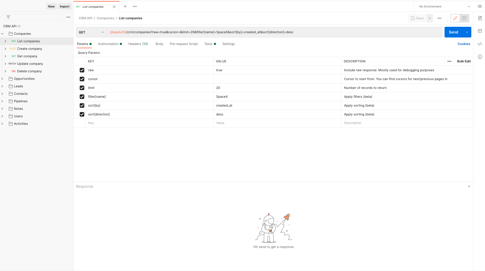
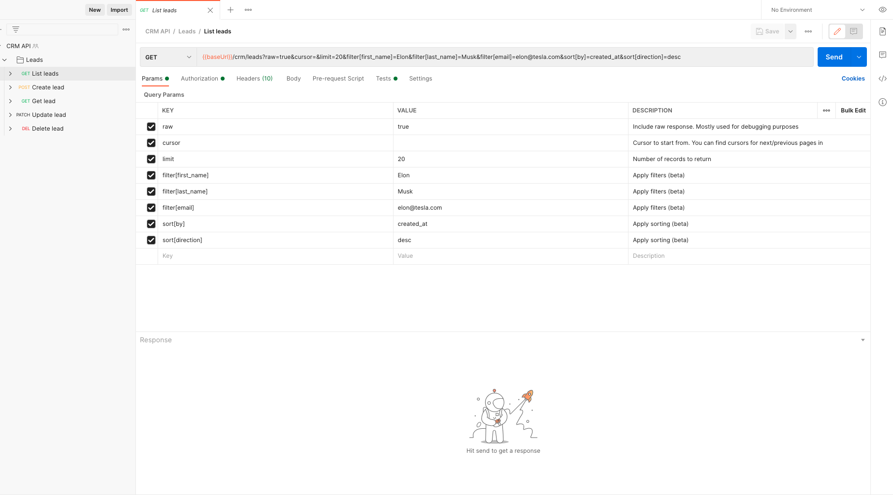

# Portman CLI options

This example contains a setup that focuses on the filtering of the OpenAPI document before it gets converted by Portman, into a Postman collection.

_use-case_: Reduce a large OpenAPI document, by filtering out operations based on flags, tags, methods, operations, ... for which you want to generate Postman tests.

## CLI usage

```ssh
portman --cliOptionsFile ./examples/cli-filtering/portman-cli-options.json
```

## Portman CLI options settings

./examples/cli-filtering/portman-cli-options.json >>

```json
{
  "url": "https://raw.githubusercontent.com/apideck-libraries/openapi-specs/master/crm.yml",
  "baseUrl": "http://localhost:3050",
  "output": "./examples/cli-filtering/crm.postman.json",
  "oaOutput": "./examples/cli-filtering/filtered-crm.leads.yml",
  "filterFile": "./examples/cli-filtering/oas-format-filter.json",
  "includeTests": true,
  "syncPostman": false,
  "runNewman": false
}
```

## Example explained

The used [remote spec](https://raw.githubusercontent.com/apideck-libraries/openapi-specs/master/crm.yml) contains a wide range of API operations for Companies, Opportunities, ... but for our test suite, we want to focus on just generation tests for the "Leads" API operations.

To do this, we can use the `filterFile` option from Portman to filter out all the unwanted API operations based on the tags used in the OpenAPI spec, to only keep the "Leads" `tags`.

In the Portman CLI config above, we have defined the parameter `"filterFile":  "./examples/cli-filtering/oas-format-filter.json"`, which contains the items to filter out.

The OpenAPI spec has tagged its operations with the appropriate tags, so it is very straightforward to use the "tags" as target for filtering.

List of tags that used in the OpenAPI spec:
```yaml
"tags": [
    {
      "name": "Companies",
      "description": ""
    },
    {
      "name": "Opportunities",
      "description": ""
    },
    {
      "name": "Leads",
      "description": ""
    },
    {
      "name": "Contacts",
      "description": ""
    },
    {
      "name": "Pipelines",
      "description": ""
    },
    {
      "name": "Notes",
      "description": ""
    },
    {
      "name": "Users",
      "description": ""
    },
    {
      "name": "Activities",
      "description": ""
    }
  ]
```

The filtering mechanism build in Portman, leverages the [openapi-format](https://github.com/thim81/openapi-format#openapi-filter-options) package.
The "openapi-format" package offers a wide range of configuration options to filter flags/tags/methods/operations/... from the OpenAPI document.

| Type         | Description                   | Type  | Examples                             |
|--------------|-------------------------------|-------|--------------------------------------|
| methods      | a list OpenAPI methods.       | array | ['get','post','put']                 |
| tags         | a list OpenAPI tags.          | array | ['Activities','Users']               |
| operationIds | a list OpenAPI operation ID's.| array | ['leadsAll','leadsAdd']              |
| operations   | a list OpenAPI operations.    | array | ['GET::/crm/leads','PUT::/crm/leads']|
| flags        | a list of custom flags        | array | ['x-exclude','x-internal']           |

By specifying the desired filter values for the available filter types, Portman will use the openapi-format CLI to strip out any
matching item from the OpenAPI document. You can combine multiple types to filter out a range of OpenAPI items.

In our example case, we can just use the "tags" option to filter out the unwanted API operations.

./examples/cli-filtering/oas-format-filter.json >>

```json
{
  "methods": [],
  "tags": ["Companies","Opportunities","Contacts", "Pipelines", "Notes", "Users", "Activities"],
  "operationIds": [],
  "operations": [],
  "flags": [],
  "flagValues": []
}
```

Resulting in 2 outputs:

1. [Postman collection output](crm.postman.json): The generated Postman collection with only the "Leads" API requests, based on the filtered OpenAPI document
2. [OpenAPI output](filtered-crm.leads.yml): Since we defined the `oaOutput` parameter, the filtered OpenAPI output will be saved in the defined file path "filtered-crm.leads.yml". 
  
The `oaOutput` parameter is completely optional. It can be handy if you want to review/download/share the filtered OpenAPI document.

Results without filtering:



Filtered results:


