# Portman - Globals

This example focuses on the `globals` settings of Portman. It is contains some very powerful options, to manipulate or replace keys/values/strings, in the full Postman collection.

_use-case_: 

- Mass replace certain keys
- Mass replace certain values/strings/objects

## CLI usage

```ssh
portman --cliOptionsFile ./examples/portman-globals/portman-cli-options.json
```

Configured by using the portman-cli config.

This is an example where we take the OpenAPI defined in `crm.yml`, with only 1 entity (leads) to keep the example simple.

## Portman settings

The portman settings (in JSON format) consists out of multiple parts:

- **version** : which refers the Portman configuration version
- **globals**: which refers to the customization that apply for the whole Postman collection.

In this example we focus on the **globals** section and settings.

file: examples/portman-globals/portman-config.crm.json

```json
{
  "version": 1.0,
  "globals": {
    "keyValueReplacements": {
      "x-apideck-app-id": "{{applicationId}}"
    },
    "valueReplacements": {
      "<Bearer Token>": "{{bearerToken}}"
    },
    "rawReplacements": [
      {
        "searchFor": "Unify",
        "replaceWith": "Unify ApiDeck"
      }
    ],
    "portmanReplacements": [
      {
        "searchFor": "]::",
        "replaceWith": "]:-:"
      }
    ]
  }
}
```

## Portman - "globals" properties

Version 1.0

##### Globals options:

- **collectionPreRequestScripts**: Array of scripts that will be injected as Postman Collection Pre-request Scripts that will execute before every request in this collection.
- **collectionTestScripts**: Array of scripts that will be injected as Postman Collection Test Scripts that will execute after every request in this collection.
- **keyValueReplacements**: A map of parameter key names that will have their values replaced with the provided Postman variables.
- **valueReplacements**: A map of values that will have their values replaced with the provided values.
- **rawReplacements** : Consider this a "search & replace" utility, that will search a string/object/... and replace it with another string/object/...
  This is very useful to replace data from the OpenAPI specification, before it is used in the Portman test automation generation.
- **portmanReplacements** : The "search & replace" utility right before the final Postman file is written, that will search a string/object/... and replace it with another string/object/...
  This is practical to replace any data from the generated Portman collection, before it is used in Postman / Newman test execution.
- **stripResponseExamples (Boolean | optional)** : Strip the response examples from the generated Postman collection.
- **securityOverwrites** : Provide a overwrite of the OpenAPI Security Scheme Object (supported types: "apiKey", "http basic auth", "http bearer token")

## Example explained

In this example, we are zooming in on "globals" usage. For the basics on the testsuite configuration and usage in Portman, have a look at ["examples/testsuite-contract-tests"]("https://github.com/apideck-libraries/portman/tree/main/examples/testsuite-contract-tests")

file: examples/portman-globals/postman.crm.json >>

```json
"globals": {
    "collectionPreRequestScripts": [
      "pm.collectionVariables.set('status', pm.iterationData.get('status') || 'open')"
    ],
    "collectionTestScripts": [
      "pm.collectionVariables.set('applicationId', pm.iterationData.get('applicationId') || '1111');"
    ],
    "keyValueReplacements": {
      "x-apideck-app-id": "{{applicationId}}"
    },
    "valueReplacements": {
      "<Bearer Token>": "{{bearerToken}}"
    },
    "rawReplacements": [
      {
        "searchFor": "Unify",
        "replaceWith": "Unify ApiDeck"
      }
    ]
  }
```

### collectionPreRequestScripts

By setting the `collectionPreRequestScripts`, all the script items in the array will be injected to the Postman "Pre-request script" on Postman collection level.

AFTER

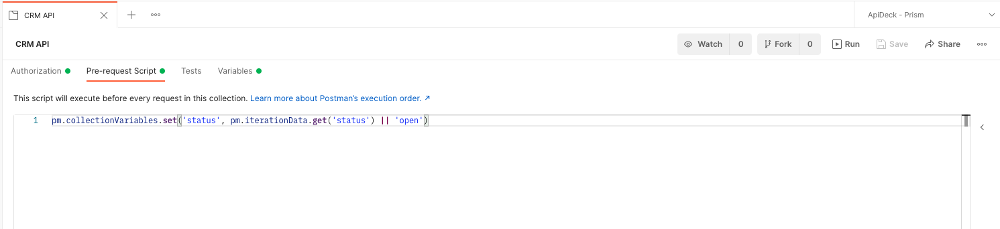

### collectionTestScripts

By setting the `collectionTestScripts`, all the script items in the array will be injected to the Postman "Test script" on Postman collection level.

AFTER

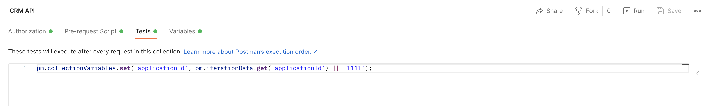

### keyValueReplacements

The result will be that any key that matches `x-apideck-app-id` will be replaced by `{{applicationId}}` in the full collection.

BEFORE

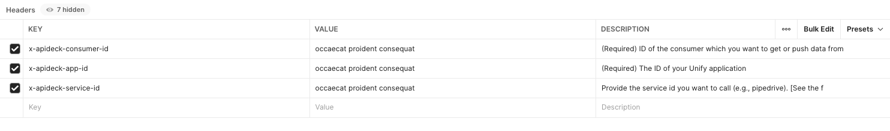

AFTER

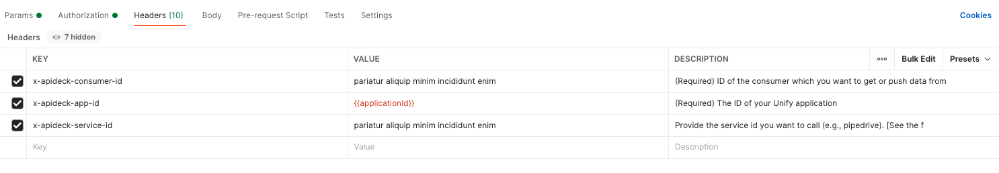

#### valueReplacements

The result will be that any value that matches `<Bearer Token>` will be replaced by the value `{{bearerToken}}` in the full collection.

BEFORE

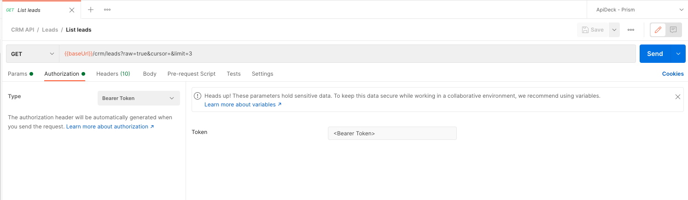

AFTER

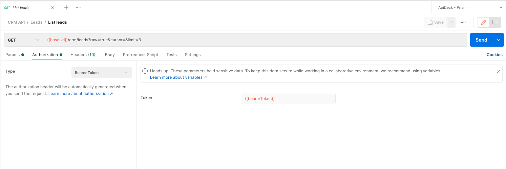

### rawReplacements

The result will be that any string/object that matches `Unify` will be replaced by the value `Unify ApiDeck` in the full collection. This also covers non-request/response data, like the description in the example.

BEFORE


AFTER

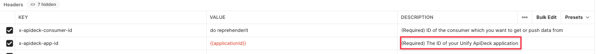

### portmanReplacements

`portmanReplacements` is not part of this example, since the example does not include any test injection.

The `rawReplacements` setting allows you to do a search & replace of any data from the OpenAPI document, before it is being used for the Portman test generation and injection. This can be useful, since the changed data from `rawReplacements` will be used during the test generation.

The `portmanReplacements` setting offers the option to modify the final generated Portman collection, before it is written as the Postman JSON file. It makes it possible to alter any of the final data before it will be used by Postman/Newman for execution.
The main use-case would be to search & replace any of the generated Portman test code.

Example:
```json
{
  "version": 1.0,
  "globals": {
    "portmanReplacements": [
      {
        "searchFor": "]::",
        "replaceWith": "]:-:"
      }
    ]
  }
}
```

Based on the above configuration we will alter any `]::` to `]:-:`.
The `]::` characters are part of the generated test name by Portman, example: `pm.test("[GET]:-:/crm/leads - Status code is 2xx", function () {`.

By defining `portmanReplacements`, you can modify any snippet that is injected by Portman, like the test names, correct part of the JSON schema, ... that you would not be able to modify by the available "overwrite" methods.

BEFORE

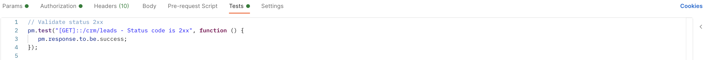

AFTER

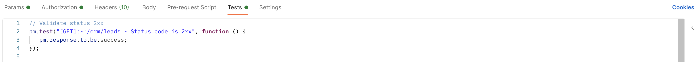


### stripResponseExamples

As part of the conversion from OpenAPI to Postman, all requests will get response examples in Postman. When generating variations, the number of examples can grow quickly.
To keep the Postman collection compact, you can use the CLI option `--stripResponseExamples`. This option will strip response examples from the final generated collection.

Example:
```json
{
  "version": 1.0,
  "globals": {
    "stripResponseExamples": true
  }
}
```

BEFORE

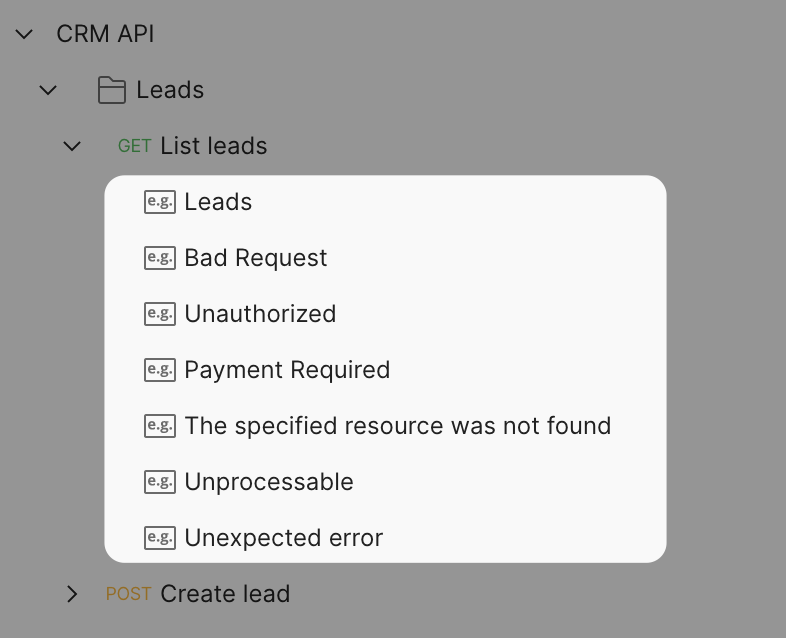

AFTER

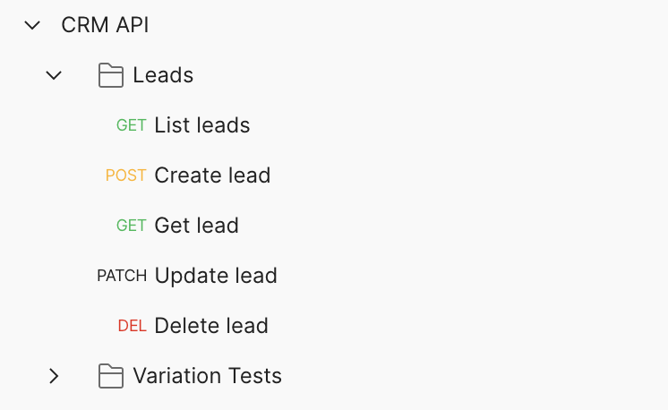

### securityOverwrites

The security overwrites provides a number of security types:

- **apiKey**: The API key auth will send a key-value pair to the API either in the request headers or query parameters.
  - **value (String)** : The value that will be inserted as the Postman apiKey value. It can be a plain value or a Postman variable.
  - **key (String | optional)** : The "key" value that will be inserted in the Postman apiKey key field. It can be a plain value or a Postman variable.
  - **in (String | optional)** : The "in" value that defines where the Api Key will be added in the Postman request Header or Query params. Postman supports `header` for "Header" or `query` for "Query Params".

```json
"securityOverwrites": {
      "apiKey": {
        "value": "{{apiKey}}"
      }
    }
```

- **bearer**: The bearer tokens allow requests to authenticate using an access key, such as a JSON Web Token (JWT).
  - **token (String)** : The "token" that will be inserted as the Postman bearer token value. It can be a plain value or a Postman variable.

```json
"securityOverwrites": {
      "bearer": {
        "token": "{{bearerToken}}"
      }
    }
```

- **basic**: Basic authentication involves sending a verified username and password with your request.
  - **username (String)** : The username that will be inserted as the basic authentication username value
  - **password (String)** : The password that will be inserted as the basic authentication password value

```json
"securityOverwrites": {
      "basic": {
        "username": "{{username}}",
        "password": "{{password}}",
      }
    }
```

Next to the above security overwrites, you can also insert/overwrite Postman authorization.

- **Postman Type (Array)** : The Postman authorization option type. Supported types are: `awsv4`, `digest`, `edgegrid`, `ntlm`, `oauth1`, `oauth2`
  - **key (String)** : The authorization "key" that will be used as the Postman authorization setting. 
  - **value (String | Boolean)** : The value that will be inserted as the Postman authorization value for the Postman authorization setting (key).
  - **type (String)** : The "type" of value, which is used to determine how the value is inserted. Supported types are: `string`, `boolean`.

The easiest way to define it, is to set it manually in Postman, export the collection and extract the matching values from the JSON file.

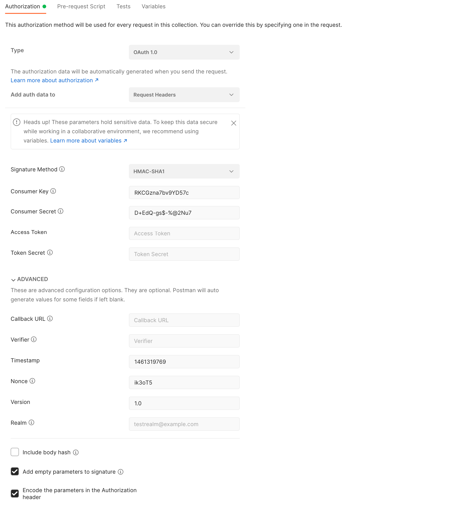

which would result in the following Portman configuration:
```json
{
  "globals": {
    "securityOverwrites": {
      "oauth1": [
        {
          "key": "addEmptyParamsToSign",
          "value": true,
          "type": "boolean"
        },
        {
          "key": "timestamp",
          "value": "1461319769",
          "type": "string"
        },
        {
          "key": "nonce",
          "value": "ik3oT5",
          "type": "string"
        },
        {
          "key": "consumerSecret",
          "value": "D+EdQ-gs$-%@2Nu7",
          "type": "string"
        },
        {
          "key": "consumerKey",
          "value": "RKCGzna7bv9YD57c",
          "type": "string"
        },
        {
          "key": "signatureMethod",
          "value": "HMAC-SHA1",
          "type": "string"
        },
        {
          "key": "version",
          "value": "1.0",
          "type": "string"
        },
        {
          "key": "addParamsToHeader",
          "value": false,
          "type": "boolean"
        }
      ]
    }
  }
}
```
