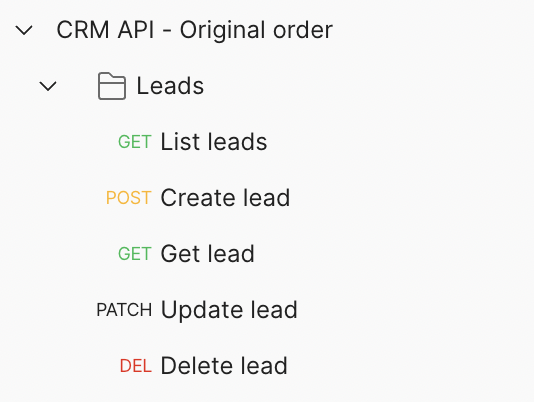
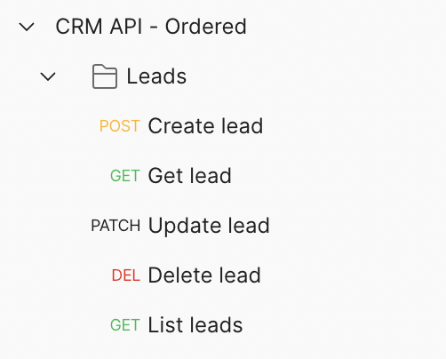

# Postman collection request ordering

This example contains the setup of Portman to convert & sort an OpenAPI, with sorting of the Postman requests.

_use-case_: execute Postman requests in a certain order typically linked to test scenario's, like CRUD.

## CLI usage

```ssh
portman -l ./examples/postman-ordering/crm.yml -t false -c ./examples/postman-ordering/portman-config.ordering.json
```

This is a very simple example where we just take the `crm.yml` OpenAPI and convert it with ordering in place.

## Portman settings

The `orderOfOperations` is a list of OpenAPI operations, which is used by Portman to sort the Postman requests in the
desired order.

> **Note**
> The ordering from `orderOfOperations` is performed per folder.

The OpenAPI operation is the unique combination of the OpenAPI method & path, with a `::` separator symbol.
The example: `"GET::/crm/leads"` will target only the "GET" method and the specific path "/crm/leads".

> **Warning**
> Items that are **not** defined in the `orderOfOperations` list will remain at their current order, within their folder.

## Example explained

In our example we want to run the execution of the CRM leads operations in specific order in Postman.

So in our Portman configuration file , we have defined the `orderOfOperations` with the desired order for the "leads"
endpoints. 

./examples/postman-ordering/portman-config.ordering.json >>

````json
{
  "orderOfOperations": [
    "POST::/crm/leads",
    "GET::/crm/leads/{id}",
    "PATCH::/crm/leads/{id}",
    "DELETE::/crm/leads/{id}",
    "GET::/crm/leads"
  ]
}
````

The result will be that initial OpenAPI file, with the operations orders like:

./examples/postman-ordering/crm.yml >>

```yaml
paths:
    /crm/leads:
      get:
        operationId: leadsAll
        summary: List leads
      post:
        operationId: leadsAdd
        summary: Create lead
    '/crm/leads/{id}':
        get:
          operationId: leadsOne
          summary: Get lead
        patch:
          operationId: leadsUpdate
          summary: Update lead
        delete:
          operationId: leadsDelete
          summary: Delete lead

```

will be converted in a Postman Collection that is order like this:

./examples/postman-ordering/crmApi.json >>

```json
{
  "item": [
    {
      "id": "7aba139c-6c52-4d20-a1f2-e5f54482dd31",
      "name": "Leads",
      "item": [
        {
          "id": "eeca3dd2-c57f-4ba9-b347-927b0fa867dc",
          "name": "Create lead"
        },
        {
          "id": "c9807808-5c7b-4194-b899-5d0317c1ddc1",
          "name": "Get lead"
        },
        {
          "id": "1e6e89d5-a975-4f34-b548-b16d64e12ba7",
          "name": "Update lead"
        },
        {
          "id": "41e14505-3cd5-461d-a252-16af1ac9894d",
          "name": "Delete lead"
        },
        {
          "id": "240d8dd4-ea17-4e66-a564-2ed7380d559a",
          "name": "List leads"
        }
      ]
    }
  ]
}
```

**End result**



Original order for items as defined in OpenAPI:
1) List leads - GET
2) Create lead - POST
3) Get lead - GET
4) Update lead - PATCH
5) Delete lead - DELETE

Ordered items in Postman after conversion as defined in the Portman configuration:



1) Create lead - POST
2) Get lead - GET
3) Update lead - PATCH
4) Delete lead - DELETE
5) List leads - GET
