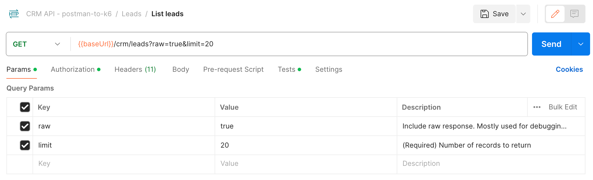
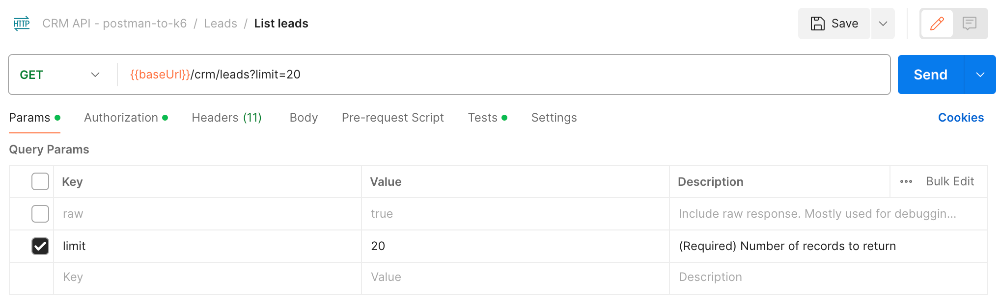

# OpenAPI Postman test suite generation - postman-to-k6

This example focuses on configuring the basic Portman settings to generate a Postman collection that is compatible with the [postman-to-k6 module](https://www.npmjs.com/package/@apideck/postman-to-k6).

> The postman-to-k6 converter utilizes your Postman collection and converts all the Postman requests, including tests, variables, ... to K6 scripts that can be executed by K6 to run performance tests.

_use-cases_:

- Generate Postman collection to be used for K6 load testing

## CLI usage

```shell
portman --cliOptionsFile ./examples/postman-to-k6/portman-cli-options.json
```

Configured by using the portman-cli config.

## Portman settings

```json
{
  "$schema": "https://raw.githubusercontent.com/apideck-libraries/portman/main/src/utils/portman-config-schema.json",
  "version": 1.0,
  "tests": {
    "contractTests": [
      {
        "openApiOperation": "*::/*",
        "statusSuccess": {
          "enabled": true
        }
      }
    ]
  },
  "assignVariables": [],
  "overwrites": [],
  "globals": {
    "stripResponseExamples": true,
    "separatorSymbol": "=="
  }
}
```

## Globals

### stripResponseExamples

As part of the conversion from OpenAPI to Postman, all requests will get response examples in Postman. When generating variations, the number of examples can grow quickly.
To keep the Postman collection compact, you can use the CLI option `--stripResponseExamples`. This option will strip response examples from the final generated collection.

### separatorSymbol

```json
{ 
  "globals": {
      "separatorSymbol": "=="
    }
}
```
This setting allows you to change the separator symbol for the auto-generated Postman testName description (Example: [GET]::/crm/leads - Status code is 2xx). 
K6 will throw an error when `::` is used in the K6 script.

```shell
ERRO[0010] GoError: group and check names may not contain '::'
running at go.k6.io/k6/js/modules/k6.(*K6).Check-fm (native)
```

An alternative approach is to use the `portmanReplacements` setting to replace the `::` with something else.

```json
{
  "globals": {
    "portmanReplacements": [
      {
        "searchFor": "::",
        "replaceWith": "=="
      }
    ]
  }
}
```

## Tests

A common approach for testing is that you use the `contractTests` to validate the response status code, response schema, ... 
While for performance testing, you want to validate the HTTP response status code. The response schema and other content tests are not relevant for performance testing.

To achieve this, you can use the `tests` setting to configure the `contractTests` to only validate the response status code.
```json
{
  "tests": {
    "contractTests": [
      {
        "openApiOperation": "*::/*",
        "statusSuccess": {
          "enabled": true
        }
      }
    ]
  }
}
```

### OpenAPI to Postman conversion

By using `--postmanConfigFile` you provide a specific configuration file that will be used for converting the OpenAPI specification to Postman.

```shell
portman --cliOptionsFile ./examples/postman-to-k6/portman-cli-options.json --postmanConfigFile ./examples/postman-to-k6/postman-config.json
```

Portman converts an OpenAPI specification to Postman with some settings optimized for the Postman application (stripping headers, toggling on/off query params, ...)
To provide a better experience for K6, the OpenAPI to Postman conversion will require some extra Postman specific settings to the Postman collection.

```json
{
  "folderStrategy": "Tags",
  "requestParametersResolution": "Example",
  "exampleParametersResolution": "Example",
  "keepImplicitHeaders": true,
  "enableOptionalParameters": false
}
```

The `folderStrategy` is set to `Tags` to group the requests in Postman by their tags, which will also be applied to the generated K6 requests.
Keeping the grouping and naming of the requests in K6 the same as in Postman.

The `requestParametersResolution` and `exampleParametersResolution` are set to `Example` to use the example values from the OpenAPI specification as the default values for the Postman & K6 requests.

The `keepImplicitHeaders` is set to `true` to keep the implicit headers in the Postman collection. 
Since Postman will add headers automatically when sending the request, but they will not be part of the exported Postman collection by default.
Typically this would be the `"Content-Type": "application/json"` header.
When the Postman collection is used for K6, these implicit headers will be missing for the K6 requests
So setting this option to `true` will keep these implicit headers in the Postman collection and they will be part of the generated K6 requests.

The `enableOptionalParameters` is set to `false` to disable the optional parameters in the Postman collection.
When in the OpenAPI specification, a parameter is not set as `required`, the Postman collection will add this parameter to the Postman collection but the query parameter will be disabled in Postman.
When the Postman collection is used for K6, these optional parameters will be not be part of the K6 requests.

**BEFORE**
All the query parameters are enabled in the Postman collection.


**AFTER**
Only the required query parameters are enabled in the Postman collection.

