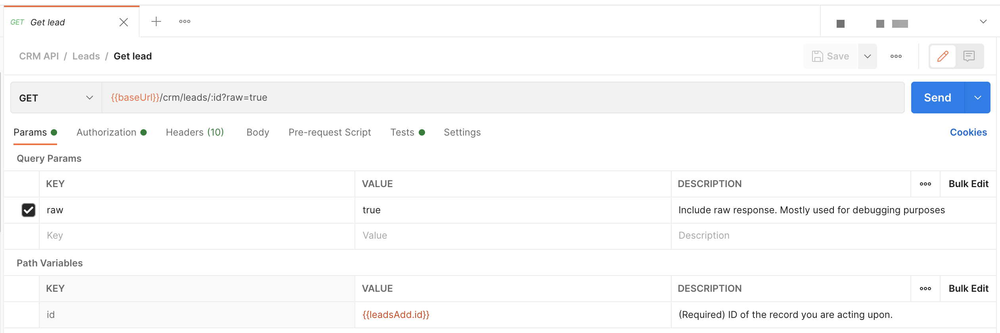

# OpenAPI Postman test suite generation - assignVariables

In the "[examples/testsuite-contract-tests](https://github.com/apideck-libraries/portman/tree/main/examples/testsuite-contract-tests)" example, we explained the default generated Postman contract tests.

This example focuses on assigning Postman variables based on the response of an API request, with the goal to be able to reuse them in other requests.

_use-cases_:

- Generate Postman flows that require values from previous operations

- Reference a created entity to be used in Read/Update/Delete flows by setting the ID reference as query parameter

## CLI usage

```ssh
portman --cliOptionsFile ./examples/testsuite-assign-variables/portman-cli-options.json
```

Configured by using the portman-cli config.

This is an example where we take the OpenAPI defined in `crm.yml`, with only 1 entity (leads) to keep the example simple and convert to Postman with all the default contract tests generated out-of-the-box + set Postman variables from executed Postman requests.

## Portman settings

The portman settings (in JSON format) consists out of multiple parts.
In this example we focus on the **assignVariables** section and settings.

file: examples/testsuite-assign-variables/portman-config.crm.json

## Portman - "assignVariables" properties

Version 1.0

To facilitate automation, we provide the option to set Postman collection variables with values from the response. The assigning of the "pm.collectionVariables" are mapped based on the OpenAPI operationId or OpenAPI Operation reference.

### Target options:

- **openApiOperationId (String)** : Reference to the OpenAPI operationId for which the Postman pm.collectionVariables variable
  will be set. (example: `listPets`)
- **openApiOperation (String)** : Reference to the combination of the OpenAPI method & path, for which the Postman
  pm.collectionVariables will be set. (example: `GET::/pets`)

These target options are both supported for defining a target. In case both are set for the same target, only the `openApiOperationId` will be used for overwrites.

### collectionVariables options:

- **collectionVariables (Array)** : 
  
  Array of key/value pairs to set the Postman collection variables.
  
  - **responseBodyProp (String)** : The property for which the value will be taken in the response body and set the value as the pm.collectionVariables value.
  - **responseHeaderProp (String)** : The property for which the value will be taken in the response header and set the value as the pm.collectionVariables value.
  - **requestBodyProp (String)** : The property for which the value will be taken in the request body and set the value as the pm.collectionVariables value.
  - **value (String)** : The defined value that will be set as the pm.collectionVariables value.
  - **name (String OPTIONAL | Default: openApiOperationId.responseProp** : The name that will be used to overwrite the default generated variable name.

## Example explained

In this example, we are zooming in on only the assignVariables usage. For the basics on the portman configuration and usage, have a look at ["examples/testsuite-contract-tests"]("https://github.com/apideck-libraries/portman/tree/main/examples/testsuite-contract-tests")

file: examples/testsuite-assign-variables/portman-config.crm.json >>

```json
  "assignVariables": [
    {
      "openApiOperation": "POST::*",
      "collectionVariables": [
        {
          "responseBodyProp": "data.id"
        }
      ]
    },
    {
      "openApiOperation": "GET::/crm/leads/{id}",
      "collectionVariables": [
        {
          "responseBodyProp": "data.company_name"
        },
        {
          "responseHeaderProp": "Operation-Location"
        }
      ]
    },
    {
      "openApiOperationId": "leadsAdd",
      "collectionVariables": [
        {
          "requestBodyProp": "company_name",
          "name": "leadsAdd.company_name"
        }
      ]
    }
  ]
```

### assignVariables from responseBodyProp

```json
  "assignVariables": [
    {
      "openApiOperationId": "leadsAdd",
      "collectionVariables": [
        {
          "responseBodyProp": "data.id",
          "name": "leadsAdd.id"
        }
      ]
    }
  ],
```

This will target the OpenAPI `"openApiOperationId": "leadsAdd"` and will assign the `data.id` from the request body to a Postman collection variable with the name `leadsAdd.id`

The API response for the create operation will contain:

```json
{
  "status_code": 200,
  "status": "OK",
  "service": "zoho-crm",
  "resource": "companies",
  "operation": "one",
  "data": {
    "id": "12345"
  }
}
```

After the conversion, in the "leadsAdd" request (POST::/crm/leads) in the Postman app, you can find the following result in the test tab.

file: examples/testsuite-assign-variables/crm.postman.json >>

Postman request "Leads" >> "Create lead" Test tab:

```js
// Set response object as internal variable
let jsonData = pm.response.json()

// pm.collectionVariables - Set leadsAdd.data.id as variable for jsonData.data.id
if (typeof jsonData.data.id !== 'undefined') {
  pm.collectionVariables.set('leadsAdd.data.id', jsonData.data.id)
  console.log('- use {{leadsAdd.data.id}} as collection variable for value', jsonData.data.id)
}
```

Each time the request is executed in Postman, the `{{$leadsAdd.id}}` variables will be updated with the `data.id` from the API response.

This allows you to capture the ID of the newly created entity.

For easier usage, the Postman variable name is shown in the console log of Portman & Postman.

## assignVariables from all responseBodyProp

It is very common that he test suite will create a Postman variable for the ID property in the response object of the create/POST operation (if `ID` is present in the response).

```json
assignVariables": [
    {
      "openApiOperation": "POST::*",
      "collectionVariables": [
        {
          "responseBodyProp": "data.id"
        }
      ]
    }
  ]
```

The snippet above targets all POST operations, for any path.

```javascript
// pm.collectionVariables - Set leadsAdd.data.id as variable for jsonData.data.id
if (typeof jsonData.data.id !== 'undefined') {
  pm.collectionVariables.set('leadsAdd.data.id', jsonData.data.id)
  console.log('- use {{leadsAdd.data.id}} as collection variable for value', jsonData.data.id)
}
```

## assignVariables from responseHeaderProp

```json
  "assignVariables": [
    {
      "openApiOperation": "GET::/crm/leads/{id}",
      "collectionVariables": [
        {
          "responseHeaderProp": "Operation-Location"
        }
      ]
    }
  ],
```

This will target the OpenAPI GET method for the `/crm/leads/{id}` and will assign the value of the specific`header` from the response header to a Postman collection.

The API response for the create operation will contain:

```json
Operation-Location: {baseUrl}/operations/bbadbeef-b3ab-40af-b05c-c0ffee6544cd
```

After the conversion, in the "leadsOne" request (GET::/crm/leads/{id}) in the Postman app, you can find the following result in the test tab.

file: examples/testsuite-assign-variables/crm.postman.json >>

Postman request "Leads" >> "Get lead" Test tab:

```js
// pm.collectionVariables - Set leadsOne.Operation-Location as variable for header
let leadsOneOperationLocation = pm.response.headers.get('Operation-Location')
if (leadsOneOperationLocation !== undefined) {
  pm.collectionVariables.set('leadsOne.Operation-Location', leadsOneOperationLocation)
  console.log(
    '- use {{leadsOne.Operation-Location}} as collection variable for value',
    leadsOneOperationLocation
  )
}
```

## assignVariables from requestBodyProp

```json
  "assignVariables": [
    {
      "openApiOperationId": "leadsAdd",
      "collectionVariables": [
        {
          "requestBodyProp": "company_name",
          "name": "leadsAdd.company_name"
        }
      ]
    }
  ],
```

This will target the OpenAPI with OperationId `leadsAdd` and will assign the value of the request body to a Postman collection.

The request body for the create operation will contain:

```json
{
    "company_name": "Spacex",
    "owner_id": "54321",
```

After the conversion, in the "leadsAdd" request (Post::/crm/leads) in the Postman app, you can find the following result in the test tab.

file: examples/testsuite-assign-variables/crm.postman.json >>

Postman request "Leads" >> "Post lead" Test tab:

```js
// pm.collectionVariables - Set leadsAdd.company_name as variable from request body
pm.collectionVariables.set('leadsAdd.company_name', 'Spacex')
console.log('- use {{leadsAdd.company_name}} as collection variable for value', 'Spacex')
```

The value will be taken from the original OpenAPI request body.

## assignVariables with usage in overwriteRequestQueryParams

In combination with the `overwrites` option, you can then chain the Creation operation with the Read/Update/Delete operations. You can use the `{{$leadsAdd.id}}` to set the request path variables.

```json
"overwrites": [
    {
      "openApiOperation": "GET::/crm/leads/{id}",
      "overwriteRequestPathVariables": [
        {
          "key": "id",
          "value": "{{leadsAdd.id}}",
          "overwrite": true
        }
      ]
    },
    {
      "openApiOperation": "PATCH::/crm/leads/{id}",
      "overwriteRequestPathVariables": [
        {
          "key": "id",
          "value": "{{leadsAdd.id}}",
          "overwrite": true
        }
      ]
    },
    {
      "openApiOperation": "DELETE::/crm/leads/{id}",
      "overwriteRequestPathVariables": [
        {
          "key": "id",
          "value": "{{leadsAdd.id}}",
          "overwrite": true
        }
      ]
    }
  ]
```

Which will result in the Path variables for GET/PATCH/DELETE for the path `/crm/leads/{id}` will be set with the `{{leadsAdd.id}}` Postman collection variable.



### assignVariables + contentTests

Another option is to combine "assignVariables" with "contentTests".

Create Lead request body

```json
{
    "name": "{{leadsAdd.name}}",
    "company_name": "Spacex",
    "owner_id": "54321"
   ...
}
```

Assign the variable from the request body through our "assignVariables" definition.

```json
assignVariables": [
    {
      "openApiOperationId": "leadsAdd",
      "collectionVariables": [
        {
          "requestBodyProp": "company_name",
          "name": "lead.company_name"
        }
      ]
    }
  ]
```

This will target the OpenAPI `"openApiOperation": "leadsAdd"` and will get the `company_name` from the request body (which is defined in OpenAPI)(before the Postman request is send).

Postman request "Leads" >> "Create lead" test:

```js
// pm.collectionVariables - Set leadsAdd.company_name as variable from request body
pm.collectionVariables.set('leadsAdd.company_name', 'Spacex')
console.log('- use {{leadsAdd.company_name}} as collection variable for value', 'Spacex')
```

Next we want to validate in the `company_name` which we used to create the entity, is matching with the `company_name` when requesting the lead details of our newly created entity.

Get Lead response

```json
{
    "status_code": 200,
    "status": "OK",
    "service": "zoho-crm",
    "resource": "companies",
    "operation": "one",
    "data": {
        "id": "12345",
        "owner_id": "54321",
        "company_id": "2",
        "company_name": "Spacex"
        ...
}
```

For this we use a "contenCheck":

```json
"contentTests": [
    {
      "openApiOperationId": "GET::/crm/leads/{id}",
      "checkRequestBody": [
        {
          "key": "data.company_name",
          "value": "{{leadsAdd.company_name}}"
        }
      ]
    }
  ]
```

which will generate a Postman test for the `"openApiOperation":"GET::/crm/leads/{id}"` operation that check if the value from the "company_name" which is created through the create lead API, matches with the get lead API data.

Postman request "Leads" >> "Get lead" test:

```js
// Set response object as internal variable
let jsonData = pm.response.json()

// Response body should have property "data.company_name"
pm.test(
  "[GET] /crm/leads/{id} - Content check if property 'data.company_name' exists",
  function () {
    pm.expect(typeof jsonData.data.company_name !== 'undefined').to.be.true
  }
)

// Response body should have value "{{leadsAdd.company_name}}" for "data.company_name"
if (typeof jsonData.data.company_name !== 'undefined') {
  pm.test(
    "[GET] /crm/leads/{id} - Content check if value for 'data.company_name' matches '{{leadsAdd.company_name}}'",
    function () {
      pm.expect(jsonData.data.company_name).to.eql(pm.environment.get('leadsAdd.company_name'))
    }
  )
}
```
