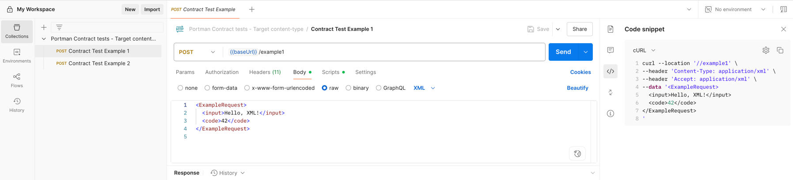

# Contract tests for OpenAPI content types

This example demonstrates how to configure Portman contract tests to target specific
request and response content types defined in an OpenAPI document.
The provided OpenAPI spec exposes two endpoints, `/example1` and `/example2`,
that accept and return XML, JSON and plain text formats.

_use-case_: generate a Postman collection with a contract test that target a specific request body and response content-type

## Try this example yourself using the portman CLI

Download the following files and run portman from this directory:
- [Download OpenAPI spec](./content-types.openapi.yml)
- [Download Portman config](./portman-config.content-types.yml)

```bash
portman --cliOptionsFile ./portman-cli-options.json
```

## Portman configuration settings

The `portman-config.content-types.yml` file contains a single `contractTests`
entry that demonstrates using wildcards to target every POST operation and
select the request and expected response content type.

```yml
version: 1
tests:
  contractTests:
    # Use XML request and expect XML response with code 200
    - openApiOperation: "POST::/*"
      openApiRequest: "application/xml"
      openApiResponse: "200::application/xml"
      statusCode:
        enabled: true
globals:
  # For every request generated omit the Postman examples
  # This helps keep the generated test collection leaner
  stripResponseExamples: true
```

### Scenario overview

This configuration generates two requests in the resulting Postman collection,
one for `/example1` and another for `/example2`. Both requests will send and
expect `application/xml` content types and validate a `200` response code.



### Understanding the configuration

- **openApiOperation** - can be a specific path/method pair or contain wildcards
  like `POST::/*` to apply the same test to several operations.
- **openApiRequest** - tells Portman which request body content type to use when
  generating the request. Here it is set to `application/xml` so the XML example
  from the spec is used.
- **openApiResponse** - selects the expected response status code and content
  type. This ensures Portman validates the XML schema from the `200` response.

You can duplicate this `contractTests` entry with different settings to create
additional tests for JSON or plain text. This way you can cover every content
type your API exposes.

### What's next?

Run the resulting collection in Postman or with Newman to verify your API
behavior. For more advanced scenarios that combine multiple request and
response formats, explore the
[`testsuite-variation-content-types`](../testsuite-variation-content-types)
example in this repository.
