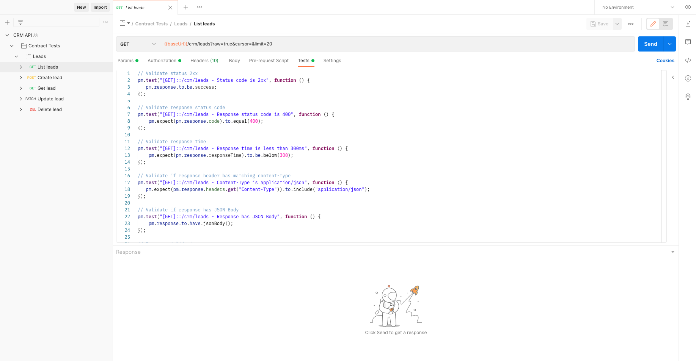

# OpenAPI Postman test suite generation - Contract Tests

Contract Tests validate that API responses match what was defined in the OpenAPI specification, ie: what was in *the contract*. 

You can think of Contract Tests as "happy path" tests.  Portman generates a single request per API endpoint using the request headers, parameters and/or request bodies defined as necessary by the OpenAPI spec, so that the API should generate a 200 response.  Portman is good at automatically generating a set of tests that validate that the response matches what was defined in the spec and does it with a minimum of configuration.   

Contract Tests don't do the following:
  - validate that the values in an API response match what was expected - consider [content tests](../testsuite-content-tests/readme.md) for that
  - test scenarios that evolve over multiple API calls, for example creating an object with a POST request, modifying it with a PUT request, validating that exists with a GET request and then deleting it with a DELETE request. - consider learning how to leverage dynamic Postman environment variables using the [assignVariables](../testsuite-assign-variables/readme.md) and [assignOverwrite](../testsuite-assign-overwrite/readme.md) portman directives for that.
  - validate that your API correctly responds to invalid, but predictable input - consider [variation tests](../testsuite-variation-tests/readme.md) for that
  - validate that your API is robust to unexpected input - consider [fuzz testing](../testsuite-fuzzing-tests/readme.md) for that
  

This example contains the setup of Portman contract test generation, which will convert an OpenAPI document that defines a CRM API to a Postman collection, which will include a set of tests for each Method/Endpoint. The generated tests are focused on the API contracts (the definition of the request/response with all properties), hence the reference to "API contract testing".

_use-case_: convert OpenAPI to Postman with a range of Portman contract tests, automatically generated, without any complex configuration or manually written tests.

## Try this example yourself using the portman CLI
You can run this example yourself by downloading the following two files:
- [Download Sample CRM API Spec](./crm.openapi.yml)
- [Download Sample Contract Test Config](./portman-config.crm.yml)

This example assumes you are running portman from the same directory that you download these file to, and have [installed portman locally](../../README.md#local-installation-recommended) and are running the command from the top level directory in your project. If you [installed portman globally](../../README.md#global-installation) remove the `npx` from the beginning of the command.  

The example command ignores any existing portman configuration you may have setup, but if you are familiar with portman configuration you can include other parameters, for example those to automatically push the collection to Postman.

```ssh
npx portman -l ./crm.openapi.yml  -c ./portman-config.crm.yml
```
Since this example has no other configuration, portman will generate ./tmp/converted/crmApiContractTests.json.   You can import this into postman to view the request and the tests described in this readme.

This is an example where we take the OpenAPI defined in `crm.openapi.yml`, with only 1 entity (leads) to keep the example simple and convert to Postman with all the default contract tests generated out-of-the-box.

## Portman configuration settings

The portman settings example consists out of multiple parts:

- **version** : which refers the Portman configuration version
- **tests** : which refers the definitions for the generated contract & variance tests.
    - **contractTests** : refers to the options to enabled autogenerated contract tests.
    - **contentTests**:  which refers to the additional tests that check the content.
    - **variationTests** : refers to the options to define variation tests.
    - **extendTests**:  which refers the custom additions of manual created Postman tests.

In this example we focus on the **contractTests** section and settings.  We use a YAML based configuration file which is a bit more compact and supports inline comments but for those who prefer json, you can find [the same configuration in json format](./portman-config.crm.json)

file: examples/testsuite-contract-tests/portman-config.crm.yml

```yml
version: 1
tests:
  contractTests:
  # Specify the endpoint to apply the tests to: *::/crm/*
  # The first * means match any request type, ie: GET, POST, etc..
  # The second * means match any endpoint in the /crm/ path
  - openApiOperation: "*::/crm/*"
    # Check that the API returned a 200 response
    statusSuccess:
      enabled: true
    # Exclude the next test from the POST /leads and GET /crm/leads/{id} endpoint
    excludeForOperations:
    - leadsAdd
    - GET::/crm/leads/{id}
    # For all other endpoints check if response time is 300msec or less
    responseTime:
      enabled: true
      maxMs: 300
    # Check if the response contains a Content-Type header with application/json
    contentType:
      enabled: true
    # Check if the response contaisn a JSON response body
    jsonBody:
      enabled: true
    # Check if the response body attributes match the schema defined in the spec
    schemaValidation:
      enabled: true
    # Check if the response body has any other headers that are defined in the spec
    headersPresent:
      enabled: true
globals:
  # For every request generated omit the Postman examples
  # This helps keep the generated test collection leaner
  stripResponseExamples: true
```

## Portman - "contractTests" properties

Version 1.0

The following contract tests can be enabled by using the following properties:

- **statusSuccess (Boolean)**: Adds the test if the response of the Postman request return a 2xx
- **statusCode (Boolean, HTTP code)** : Adds the test if the response of the Postman request return a specific status code.
- **responseTime (Boolean)**: Adds the test to verify if the response of the Postman request is returned within a number of ms.
  - **maxMs (number)** : Define the expected number of ms for the `responseTime` check.
- **contentType (Boolean)**: Adds the test if the response header is matching the expected content-type defined in the OpenAPI spec.
- **jsonBody (Boolean)**: Adds the test if the response body is matching the expected content-type defined in the OpenAPI spec.
- **schemaValidation (Boolean)**: Adds the test if the response body is matching the JSON schema defined in the OpenAPI spec. The JSON schema is inserted inline in the Postman test.
  - **additionalProperties (Boolean)** : Extend the expected JSON schema used for the `schemaValidation` by setting all the `additionalProperties`.
- **headersPresent (Boolean)**: Adds the test to verify if the Postman response header has the header names present, like defined in the OpenAPI spec.

## Example explained

We instruct Portman to generate tests, via the `tests` section as defined in the **portmanConfigFile** file (specified via the `--portmanConfig` or `-c` command line option).

In our example configuration, we instructed postman to generate the following tests:
- **statusSuccess** - check for a 2xx response code
- **responseTime** - check for response in 300ms or less
- **contentType** - response contains header "Content-Type: application/json"
- **jsonBody** - response contains a json body
- **schemaValidation** - response body attributes match spec definition
- **headersPresent** - response contains any headers defined in spec

The result will be that portman will use the OpenAPI file (specified via the `--local` or `-l` command line option), with all request and response details, to generate a postman collection with one request for each method/endpoint combination, that will include the specified tests. When the collection is loaded into Postman you can find the specific tests in the "Tests" or "Scripts" tab for each request.

For example, after importing the generated collection (in ./tmp/converted/crmApiContractTests.json by default), open the collection "CRM API - Contract Tests" and navigate the folders "Contract Tests" >> "Leads"" >> Get lead" (3rd request in folder).  

On the "Tests" or "Script tab you should see:

```js
// Validate status 2xx 
pm.test("[GET]::/crm/leads/:id - Status code is 2xx", function () {
   pm.response.to.be.success;
});

// Validate if response header has matching content-type
pm.test("[GET]::/crm/leads/:id - Content-Type is application/json", function () {
   pm.expect(pm.response.headers.get("Content-Type")).to.include("application/json");
});

// Validate if response has JSON Body 
pm.test("[GET]::/crm/leads/:id - Response has JSON Body", function () {
    pm.response.to.have.jsonBody();
});

// Response Validation
const schema = {"type":"object","required":["status_code","status","service","resource","operation","data"],"properties":{"status_code":{"type":"integer","description":"HTTP Response Status Code","example":200},"status":{"type":"string","description":"HTTP Response Status","example":"OK"},"service":{"type":"string","description":"Apideck ID of service provider","example":"zoho-crm"},"resource":{"type":"string","description":"Unified API resource name","example":"companies"},"operation":{"type":"string","description":"Operation performed","example":"one"},"data":{"required":["name","company_name"],"x-pii":["name","email","first_name","last_name"],"properties":{"id":{"type":"string","example":"12345","readOnly":true},"owner_id":{"type":"string","example":"54321"},"company_id":{"type":["string","null"],"example":"2"},"company_name":{"type":["string","null"],"example":"Spacex"},"contact_id":{"type":["string","null"],"example":"2"},"name":{"type":"string","example":"Elon Musk"},"first_name":{"type":["string","null"],"example":"Elon"},"last_name":{"type":["string","null"],"example":"Musk"},"description":{"type":["string","null"],"example":"A thinker"},"prefix":{"type":["string","null"],"example":"Sir"},"title":{"type":["string","null"],"example":"CEO"},"status":{"type":["string","null"],"example":"New"},"monetary_amount":{"type":["number","null"],"example":75000},"currency":{"type":["string","null"],"example":"USD"},"fax":{"type":["string","null"],"example":"+12129876543"},"websites":{"type":"array","items":{"type":"object","required":["url"],"properties":{"id":{"type":["string","null"],"example":"12345"},"url":{"type":"string","example":"http://example.com"},"type":{"type":"string","x-graphql-type-name":"WebsiteType","enum":["primary","secondary","work","personal","other"],"example":"primary"}}}},"addresses":{"type":"array","items":{"type":"object","properties":{"id":{"type":["string","null"],"example":"123"},"type":{"type":"string","x-graphql-type-name":"AddressType","enum":["primary","secondary","home","office","shipping","billing","other"],"example":"primary"},"name":{"type":["string","null"],"example":"HQ US"},"line1":{"type":["string","null"],"example":"Main street","description":"Line 1 of the address e.g. number, street, suite, apt #, etc."},"line2":{"type":["string","null"],"example":"apt #","description":"Line 2 of the address"},"city":{"type":["string","null"],"example":"San Francisco","description":"Name of city."},"state":{"type":["string","null"],"example":"CA","description":"Name of state"},"postal_code":{"type":["string","null"],"example":"94104","description":"Zip code or equivalent."},"country":{"type":["string","null"],"example":"US","description":"country code according to ISO 3166-1 alpha-2."},"latitude":{"type":["string","null"],"example":"40.759211"},"longitude":{"type":["string","null"],"example":"-73.984638"}}}},"social_links":{"type":"array","items":{"required":["url"],"type":"object","properties":{"id":{"type":["string","null"],"example":"12345"},"url":{"type":"string","example":"https://www.twitter.com/apideck-io"},"type":{"type":["string","null"],"example":"twitter"}}}},"phone_numbers":{"type":"array","items":{"required":["number"],"type":"object","properties":{"id":{"type":["string","null"],"example":"12345"},"number":{"type":"string","example":"111-111-1111"},"type":{"type":"string","x-graphql-type-name":"PhoneType","enum":["primary","secondary","home","office","mobile","assistant","fax","other"],"example":"primary"}}}},"emails":{"type":"array","items":{"required":["email"],"type":"object","properties":{"id":{"type":"string","example":"123"},"email":{"type":"string","format":"email","example":"elon@musk.com"},"type":{"type":"string","x-graphql-type-name":"EmailType","enum":["primary","secondary","work","personal","billing","other"],"example":"primary"}}}},"custom_fields":{"type":"array","items":{"type":"object","required":["id"],"additionalProperties":false,"properties":{"id":{"type":"string","example":"custom_technologies"},"value":{"anyOf":[{"type":["string","null"],"example":"Uses Salesforce and Marketo"},{"type":["number","null"],"example":10},{"type":["boolean","null"],"example":true},{"type":"array","items":{"type":"string"}}]}}}},"tags":{"type":"array","items":{"type":"string"},"example":["New"]},"updated_at":{"type":"string","example":"2020-09-30T07:43:32.000Z","readOnly":true},"created_at":{"type":"string","example":"2020-09-30T07:43:32.000Z","readOnly":true}},"type":"object"}}}

// Validate if response matches JSON schema 
pm.test("[GET]::/crm/leads/:id - Schema is valid", function() {
    pm.response.to.have.jsonSchema(schema,{unknownFormats: ["int32", "int64", "float", "double"]});
});

// Validate if response header is present 
pm.test("[GET]::/crm/leads/:id - Response header Content-type is present", function () {
   pm.response.to.have.header("Content-type");
});
```

Let's review the configuration and resulting tests by section:

### statusSuccess
In our configuration we had the following:
```yaml
  - openApiOperation: "*::/crm/*"
    # Check that the API returned a 2XX response
    statusSuccess:
      enabled: true
```

Which instructed portman to generate a check to verify if the HTTP status code is within the 2xx range

```js
// Validate status 2xx
pm.test('[GET]::/crm/leads/:id - Status code is 2xx', function () {
  pm.response.to.be.success
})
```

Note that the remaining test definitions in the configuration are all under the `OpenApiOperation: "*::/crm/*"` directive and therefore apply to the GET /crm/leads/{id} endpoint which we are examining.

### responseTime

```yaml
    responseTime:
      enabled: true
      maxMs: 300
```

Generates a check to measure the response time, to be a maximum ms (which is set to 300ms in our example).  Here is an example of a test that could be generated:

```js
// Validate response time
pm.test('[GET]::/crm/leads/:id - Response time is less than 300ms', function () {
  pm.expect(pm.response.responseTime).to.be.below(300)
})
```

Note however that we also had this directive in our configuration:

```yaml
    excludeForOperations:
    - leadsAdd
    - GET::/crm/leads/{id}
    responseTime:
      enabled: true
      maxMs: 300
```
Which specifically instructed portman NOT to generate the response time test for the GET request to the `/crm/leads/{id}` endpoint, so it is not in the complete set of tests listed above.  You can however find an example of this test in the other requests in the collection.

The `excludeForOperation` directive can be applied before any test configuration.

### contentType

```yaml
    contentType:
      enabled: true
```

Generates a check to validate the content-type headers, based on the content-type defined in the OpenAPI response.

```js
// Validate if response header has matching content-type
pm.test('[GET]::/crm/leads/:id - Content-Type is application/json', function () {
  pm.expect(pm.response.headers.get('Content-Type')).to.include('application/json')
})
```

### jsonBody

```yaml
    jsonBody:
      enabled: true
```

Generates a check to validate if the response body is a JSON object, based on the content-type defined in the OpenAPI response.

```js
// Response should have JSON Body
pm.test('[GET] /crm/leads/{id} - Response has JSON Body', function () {
  pm.response.to.have.jsonBody()
})
```

### headersPresent

```yaml
    headersPresent:
      enabled: true
```

Generates a check to validate if the response has a certain HTTP header present, based on the header properties defined in the OpenAPI response.

```js
// Validate if response header is present
pm.test('[GET]::/crm/leads/:id - Response header Operation-Location is present', function () {
  pm.response.to.have.header('Operation-Location')
})
```

### schemaValidation

```yaml
    schemaValidation:
      enabled: true
```

Generates a check to validate if the response respects all the defined response properties, allowed property types, required fields, allowed enums, .... 

Portman builds a full JSON schema object based on the response defintion in the OpenAPI spec and validates that the response matches it. 

This particular test is one of the most useful, and will often catch issues with the API implementation that might have otherwise been missed without the ability to quickly generate an automated test to validate that the response meets the contract.

```js
// Response Validation
const schema = {
  type: 'object',
  required: ['status_code', 'status', 'service', 'resource', 'operation', 'data'],
  properties: {
    status_code: { type: 'integer', description: 'HTTP Response Status Code', example: 200 },
    status: { type: 'string', description: 'HTTP Response Status', example: 'OK' },
    service: { type: 'string', description: 'Apideck ID of service provider', example: 'zoho-crm' },
    resource: { type: 'string', description: 'Unified API resource name', example: 'companies' },
    operation: { type: 'string', description: 'Operation performed', example: 'one' },
    data: {
      required: ['name', 'company_name'],
      'x-pii': ['name', 'email', 'first_name', 'last_name'],
      properties: {
        id: { type: 'string', example: '12345', readOnly: true },
        owner_id: { type: 'string', example: '54321' },
        company_id: { type: ['string', 'null'], example: '2' },
        company_name: { type: ['string', 'null'], example: 'Spacex' },
        contact_id: { type: ['string', 'null'], example: '2' },
        name: { type: 'string', example: 'Elon Musk' },
        first_name: { type: ['string', 'null'], example: 'Elon' },
        last_name: { type: ['string', 'null'], example: 'Musk' },
        description: { type: ['string', 'null'], example: 'A thinker' },
        prefix: { type: ['string', 'null'], example: 'Sir' },
        title: { type: ['string', 'null'], example: 'CEO' },
        status: { type: ['string', 'null'], example: 'New' },
        monetary_amount: { type: ['number', 'null'], example: 75000 },
        currency: { type: ['string', 'null'], example: 'USD' },
        fax: { type: ['string', 'null'], example: '+12129876543' },
        websites: {
          type: 'array',
          items: {
            type: 'object',
            required: ['url'],
            properties: {
              id: { type: ['string', 'null'], example: '12345' },
              url: { type: 'string', example: 'http://example.com' },
              type: {
                type: 'string',
                'x-graphql-type-name': 'WebsiteType',
                enum: ['primary', 'secondary', 'work', 'personal', 'other'],
                example: 'primary'
              }
            }
          }
        },
        addresses: {
          type: 'array',
          items: {
            type: 'object',
            properties: {
              id: { type: ['string', 'null'], example: '123' },
              type: {
                type: 'string',
                'x-graphql-type-name': 'AddressType',
                enum: ['primary', 'secondary', 'home', 'office', 'shipping', 'billing', 'other'],
                example: 'primary'
              },
              name: { type: ['string', 'null'], example: 'HQ US' },
              line1: {
                type: ['string', 'null'],
                example: 'Main street',
                description: 'Line 1 of the address e.g. number, street, suite, apt #, etc.'
              },
              line2: {
                type: ['string', 'null'],
                example: 'apt #',
                description: 'Line 2 of the address'
              },
              city: {
                type: ['string', 'null'],
                example: 'San Francisco',
                description: 'Name of city.'
              },
              state: { type: ['string', 'null'], example: 'CA', description: 'Name of state' },
              postal_code: {
                type: ['string', 'null'],
                example: '94104',
                description: 'Zip code or equivalent.'
              },
              country: {
                type: ['string', 'null'],
                example: 'US',
                description: 'country code according to ISO 3166-1 alpha-2.'
              },
              latitude: { type: ['string', 'null'], example: '40.759211' },
              longitude: { type: ['string', 'null'], example: '-73.984638' }
            }
          }
        },
        social_links: {
          type: 'array',
          items: {
            required: ['url'],
            type: 'object',
            properties: {
              id: { type: ['string', 'null'], example: '12345' },
              url: { type: 'string', example: 'https://www.twitter.com/apideck-io' },
              type: { type: ['string', 'null'], example: 'twitter' }
            }
          }
        },
        phone_numbers: {
          type: 'array',
          items: {
            required: ['number'],
            type: 'object',
            properties: {
              id: { type: ['string', 'null'], example: '12345' },
              number: { type: 'string', example: '111-111-1111' },
              type: {
                type: 'string',
                'x-graphql-type-name': 'PhoneType',
                enum: [
                  'primary',
                  'secondary',
                  'home',
                  'office',
                  'mobile',
                  'assistant',
                  'fax',
                  'other'
                ],
                example: 'primary'
              }
            }
          }
        },
        emails: {
          type: 'array',
          items: {
            required: ['email'],
            type: 'object',
            properties: {
              id: { type: 'string', example: '123' },
              email: { type: 'string', format: 'email', example: 'elon@musk.com' },
              type: {
                type: 'string',
                'x-graphql-type-name': 'EmailType',
                enum: ['primary', 'secondary', 'work', 'personal', 'billing', 'other'],
                example: 'primary'
              }
            }
          }
        },
        custom_fields: {
          type: 'array',
          items: {
            type: 'object',
            required: ['id'],
            additionalProperties: false,
            properties: {
              id: { type: 'string', example: 'custom_technologies' },
              value: {
                anyOf: [
                  { type: ['string', 'null'], example: 'Uses Salesforce and Marketo' },
                  { type: ['number', 'null'], example: 10 },
                  { type: ['boolean', 'null'], example: true },
                  { type: 'array', items: { type: 'string' } }
                ]
              }
            }
          }
        },
        tags: { type: 'array', items: { type: 'string' }, example: ['New'] },
        updated_at: { type: 'string', example: '2020-09-30T07:43:32.000Z', readOnly: true },
        created_at: { type: 'string', example: '2020-09-30T07:43:32.000Z', readOnly: true }
      },
      type: 'object'
    }
  }
}

// Validate if response matches JSON schema
pm.test('[GET]::/crm/leads/:id - Schema is valid', function () {
  pm.response.to.have.jsonSchema(schema, { unknownFormats: ['int32', 'int64'] })
})
```

## Examples of generated tests that are not in our sample config

The following tests were not included in our example configuration but are still useful in certain situations.   We provide these example configuration in JSON format to demonstrate both YAML and JSON configuration approaches:

### statusCode
The configuration:
```json
"contractTests": [
      {
        "openApiOperation": "*::/crm/*",
        "statusCode": {
          "enabled": true,
          "code": 400
        }
      }
]
```

Generates a check to verify if the HTTP status code matches the `code`

```js
// Validate response status code 
pm.test('[GET]::/crm/leads/:id - Response status code time is 400', function () {
  pm.expect(pm.response.code).to.equal(400);
})
```

### schemaValidation - additionalProperties

```json
"contractTests": [
      {
        "openApiOperation": "*::/crm/*",
        "schemaValidation": {
          "enabled": true,
          "additionalProperties": false
        }
      }
]
```

This `additionalProperties` OpenAPI property is a powerful setting, since it allows you to specify if your API has an evolving response or fixed response, when it comes to the properties documented.
The `additionalProperties` setting in Portman provides the option to extend the expected JSON schema used for the schema validation by setting all the "additionalProperties" to "false" (strict/fixed) or "true" (fluid). 
Setting `"additionalProperties": false` will generate a contract test to validate if the response only returns the documented response properties and nothing more.
A failing contract test with `schemaValidation - additionalProperties` could indicate that there are undocumented properties OR that the API returns too much information, which could be undesired.

## CLI Option - bundleContractTests

Portman will store requests in group folders based on the tags of OpenAPI and inject the tests directly in the targeted Postman requests.

With the CLI option `bundleContractTests`, you can bundle all requests with Portman contract tests in a separate folder in Postman.
This can be useful for when running Newman tests only on certain folders, by using the Newman `--folder` option.

> **Newman run option**: `--folder <name>` 
> 
>Run requests within a particular folder/folders or specific requests in a collection. Multiple folders or requests can be specified by using --folder multiple times, like so: --folder f1 --folder f2 --folder r1 --folder r2.

The `bundleContractTests` CLI option let you define your preferred folder strategy for contract tests.

Result with `"bundleContractTests": false`


The screenshot shows the folder results in Postman with the CLI option: `"bundleContractTests": false` (which is the default), where all the request are grouped in folders on the root level.


Result with `"bundleContractTests": true`


The screenshot shows the folder results in Postman with the CLI option: `"bundleContractTests": true`, where all the request (that match the target for contract testing) are grouped in folders in the "Contract Tests" folder.
