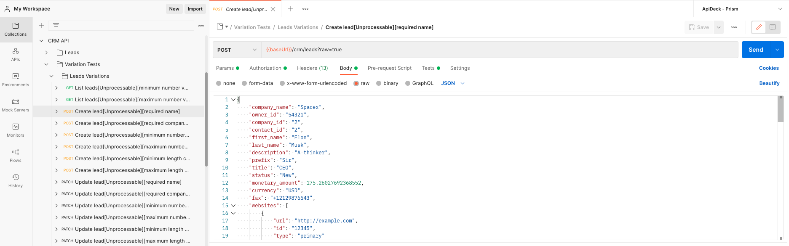
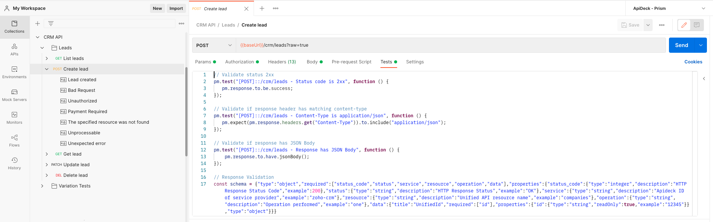
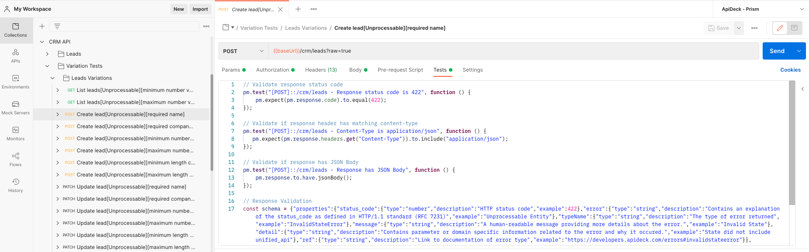

# OpenAPI Fuzzing for variation test suite generation

This example contains the configuration for the Portman fuzzing options for the variation test generation, which will convert the OpenAPI document to a Postman collection, while adding Postman tests and additional variations.

Wikipedia definition of fuzzing:
> Fuzzing or fuzz testing is an automated software testing technique that involves providing invalid, unexpected, or random data as inputs to a computer program (a REST API in the case of Portman).

Portman provides automatic [fuzzing](https://github.com/apideck-libraries/portman/tree/main/examples/testsuite-fuzzing-tests) for triggering the "unhappy" test paths.

Variation test types:

- **happy path variations**: Typically you test all possible query parameters/headers/..., that should respond with a 2xx
- **unhappy path variations** . The unhappy path is used to verify the API validation/error responses by setting unexpected values in the request inputs.

Portman provides a simple form of Fuzzing by changing the request inputs (body, query params, ... ) to unexpected values based on the OpenAPI request properties.
For each fuzzing variation, a new Postman request will be generated, for which you optionally can add contract tests, assign variables, overwrite inputs, ...

_use-cases_:

- Tests without the required query params or request body fields
- Tests with invalid inputs that are below a minimum value or above a maximum value
- Test with invalid inputs that are too long or too short
- Test responses that should return a 4xx error/validation response

## CLI usage

```ssh
portman --cliOptionsFile ./examples/testsuite-fuzzing-tests/portman-cli-options.json
```

Configured by using the portman-cli config.

## Portman settings

The portman settings (in JSON format) consists out of multiple parts:

- **version** : which refers to the Portman configuration version

- **tests** : which refers to the definitions for the generated contract & variance tests.

  - **contractTests** : refers to the options to enabled autogenerated contract tests.

  - **contentTests**: refers to the additional Postman tests that check the content.

  - **extendTests**: refers to the custom additions of manually created Postman tests.

  - **variationTests** : refers to the options to define variation tests.

In this example we focus on the **variationTests** section, more specific on the **fuzzing** options.
For more details on "Variation testing", review the [variation test example](https://github.com/apideck-libraries/portman/tree/main/examples/testsuite-variation-tests).

file: examples/testsuite-fuzzing-tests/portman-config.crm.json

```json
{
  "version": 1.0,
  "tests": {
    "variationTests": [
      {
        "openApiOperation": "*::/crm/*",
        "openApiResponse": "422",
        "variations": [
          {
            "name": "Unprocessable",
            "fuzzing": [
              {
                "requestBody": [
                  {
                    "requiredFields": {
                      "enabled": true
                    },
                    "minimumNumberFields": {
                      "enabled": true
                    },
                    "maximumNumberFields": {
                      "enabled": true
                    },
                    "minLengthFields": {
                      "enabled": true
                    },
                    "maxLengthFields": {
                      "enabled": true
                    }
                  }
                ],
                "requestQueryParams": [
                  {
                    "requiredFields": {
                      "enabled": true
                    },
                    "minimumNumberFields": {
                      "enabled": true
                    },
                    "maximumNumberFields": {
                      "enabled": true
                    },
                    "minLengthFields": {
                      "enabled": true
                    },
                    "maxLengthFields": {
                      "enabled": true
                    }
                  }
                ],
                "requestHeaders": [
                  {
                    "requiredFields": {
                      "enabled": true
                    },
                    "minimumNumberFields": {
                      "enabled": true
                    },
                    "maximumNumberFields": {
                      "enabled": true
                    },
                    "minLengthFields": {
                      "enabled": true
                    },
                    "maxLengthFields": {
                      "enabled": true
                    }
                  }
                ]
              }
            ],
            "tests": {
              "contractTests": [
                {
                  "statusCode": {
                    "enabled": true
                  }
                },
                {
                  "openApiOperation": "*::/crm/*",
                  "contentType": {
                    "enabled": true
                  }
                },
                {
                  "openApiOperation": "*::/crm/*",
                  "jsonBody": {
                    "enabled": true
                  }
                },
                {
                  "openApiOperation": "*::/crm/*",
                  "schemaValidation": {
                    "enabled": true
                  }
                },
                {
                  "openApiOperation": "*::/crm/*",
                  "headersPresent": {
                    "enabled": true
                  }
                }
              ]
            }
          }
        ]
      }
    ]
  }
}

```

## Portman - "Fuzzing" properties

Version 1.0

Variation tests can be injected by using the following properties:

- **openApiOperationId (String)** : References to the OpenAPI operationId for which a variation will be created. (example: `leadsAll`)

- **openApiOperation (String)** : References to a combination of the OpenAPI method & path for which a variation will be created. (example: `GET::/crm/leads`)

- **excludeForOperations (Array | optional)** : References to OpenAPI operations that will be skipped for targeting, example: `["leadsAdd", "GET::/crm/leads/{id}"]`

- **openApiResponse (String | optional)** : References to the OpenAPI response object code/name for which a variation will be created. (example: `"404"`). If not defined, the 1st response object from OpenAPI will be taken as the expected response. If the configured `openApiResponse` code is not defined in the OpenAPI document, Portman will not generate a variation for the targeted operations.

- **variations (Array )** : References to list of variations that will be injected

  - **name** : This allows you to define the name for the variation, which will be referenced in the Postman collection.
  - **openApiResponse (OPTIONAL)** : This allows you to define the expected openAPI response information, on which the contract tests will base their automatic generated test injection, like schema validation, jsonBody, contentType, headersPresent. If not defined, the contract tests for the specific variation will fall back on the 2xx/302 defined response in the OpenAPI specification.

  - **overwrites** : which refers to the custom additions/modifications of the OpenAPI/Postman request data, specifically for the variation.
  - **fuzzing** : Fuzzing options to set unexpected values for API requests, to cause unexpected behavior and errors in the API response.

  - **tests** : refers to the definitions for the specific tests for the variation.

    - **contractTests** : refers to the options to enabled contract tests for the variation.
    - **contentTests** : refers to the additional Postman tests that check the content for the variation.
    - **extendTests** : refers to the custom additions of manual created Postman tests to be included in the variation.

  - **assignVariables** : This refers to setting Postman collection variables that are assigned based on the variation.


## Example explained

The Portman configuration will result in a Postman collection with:

- **Normal "Leads" folder**: which could all the "happy path" tests
- **"Variation testing" folder**: which contains all the variation tests with our "fuzzed" requests.

In the example, we only included a variation configuration to keep configuration clear and compact, but you can combine the Portman configuration with all the tests (contract test, content test, overwrites, ...) options.



## Target

```json
"variationTests": [
  {
    "openApiOperation": "*::/crm/*",
    "openApiResponse": "422",
```

We want to generate test variations for all OpenAPI operations and verify if the response matches with the expected "422" response object, as defined in the OpenAPI document.

## variations

```json
"variations": [
  {
    "name": "Unprocessable",
```

The "variations" contain the list of all the variations we want to build up for the targeted request.
We can provide a "name" for the variations to easily recognize the requests in the list of Postman request. The defined "name" will be used in the generated request name. 

## fuzzing

The "fuzzing" section contains all the fuzzing options.

Portman supports fuzzing on:

### fuzzing requestBody
```json
"fuzzing": [
  {
    "requestBody": [
      {
        "requiredFields": {
          "enabled": true
        },
        "minimumNumberFields": {
          "enabled": true
        },
        "maximumNumberFields": {
          "enabled": true
        },
        "minLengthFields": {
          "enabled": true
        },
        "maxLengthFields": {
          "enabled": true
        }
      }
    ],
```

The **requestBody** config is an array of fuzzing options for the Postman Request Body.

Portman scans the OpenAPI request body for properties that can be fuzzed.
The **requestBody** configuration allows you to define for which fuzzing options you want to generate request variations.

- **requiredFields (Boolean)** : Removes the properties & values from the request body that are marked as "required" in OpenAPI.
- **minimumNumberFields (Boolean)** : Changes the values of the numeric fields to a lower value than the defined "minimum" property in the OpenAPI document.
- **maximumNumberFields (Boolean)** :  Changes the value of the numeric fields to a lower value than the defined "maximum" property in the OpenAPI document.
- **minLengthFields (Boolean)** : Changes the length of the value to a lower length than the defined "minLength" property in the OpenAPI document.
- **maxLengthFields (Boolean)** : Changes the length of the value to a higher length than the defined "maxLength" property in the OpenAPI document.

As a result, you will get automatically generated Postman requests for each possible variation found in the OpenAPI request body properties.
See the screenshot above or the generated [postman collection](./crm.postman.json).

REMARKS:
- Fuzzing is only applicable for OpenAPI request bodies of media type: "application/json"
- [Postman Dynamic variables](https://learning.Postman.com/docs/writing-scripts/script-references/variables-list/) are rendered before being fuzzed.
- Regular Postman variables are skipped from fuzzing.

### fuzzing requestQueryParams

```json
"fuzzing": [
  {
    "requestQueryParams": [
      {
        "requiredFields": {
          "enabled": true
        },
        "minimumNumberFields": {
          "enabled": true
        },
        "maximumNumberFields": {
          "enabled": true
        },
        "minLengthFields": {
          "enabled": true
        },
        "maxLengthFields": {
          "enabled": true
        }
      }
    ],
```

The **requestQueryParams** config is an array of fuzzing options for the Postman Request Query params.

Portman analyses the OpenAPI request query parameter for possible fuzzable properties.

Like for the **requestBody**, you have full control over which **requestQueryParams** fuzzing configuration you want to generate request variations.

- **requiredFields (Boolean)** : Removes the properties & values from the request body that are marked as "required" in OpenAPI.
- **minimumNumberFields (Boolean)** : Changes the values of the numeric fields to a lower value than the defined "minimum" property in the OpenAPI document.
- **maximumNumberFields (Boolean)** :  Changes the value of the numeric fields to a lower value than the defined "maximum" property in the OpenAPI document.
- **minLengthFields (Boolean)** : Changes the length of the value to a lower length than the defined "minLength" property in the OpenAPI document.
- **maxLengthFields (Boolean)** : Changes the length of the value to a higher length than the defined "maxLength" property in the OpenAPI document.

Portman uses the options to automatically generate Postman requests for each possible variation found in the OpenAPI request query parameters.
See the screenshot above or the generated [postman collection](./crm.postman.json).

### fuzzing requestHeaders

```json
"fuzzing": [
  {
    "requestHeaders": [
      {
        "requiredFields": {
          "enabled": true
        },
        "minimumNumberFields": {
          "enabled": true
        },
        "maximumNumberFields": {
          "enabled": true
        },
        "minLengthFields": {
          "enabled": true
        },
        "maxLengthFields": {
          "enabled": true
        }
      }
    ],
```

The **requestHeaders** config is an array of fuzzing options for the Postman Request headers.
By analysing the OpenAPI request headers, Portman can detects all possible fuzzable properties.

Like for the **requestBody** & **requestQueryParams** , you have full control over which **requestHeaders** fuzzing configuration you want to generate request variations.

- **requiredFields (Boolean)** : Removes the properties & values from the request headers that are marked as "required" in OpenAPI.
- **minimumNumberFields (Boolean)** : Changes the values of the numeric fields to a lower value than the defined "minimum" property in the OpenAPI document.
- **maximumNumberFields (Boolean)** :  Changes the value of the numeric fields to a lower value than the defined "maximum" property in the OpenAPI document.
- **minLengthFields (Boolean)** : Changes the length of the value to a lower length than the defined "minLength" property in the OpenAPI document.
- **maxLengthFields (Boolean)** : Changes the length of the value to a higher length than the defined "maxLength" property in the OpenAPI document.

Portman uses the options to automatically generate Postman requests for each possible variation found in the OpenAPI request headers.
See the screenshot above or the generated [postman collection](./crm.postman.json).

### variation contract test

```json
"tests": {
      "contractTests": [
        {
          "statusCode": {
            "enabled": true
          }
        },
        {
          "openApiOperation": "*::/crm/*",
          "contentType": {
            "enabled": true
          }
        },
        {
          "openApiOperation": "*::/crm/*",
          "jsonBody": {
            "enabled": true
          }
        },
        {
          "openApiOperation": "*::/crm/*",
          "schemaValidation": {
            "enabled": true
          }
        },
        {
          "openApiOperation": "*::/crm/*",
          "headersPresent": {
            "enabled": true
          }
        }
      ]
    }
```

The contract tests will be injected for each generated fuzzing variation.

In our example, Portman will add for each variation:  a status code check, a content-type check, a response JSON body check, a header check, and a JSON schema validation; all based on the expected OpenAPI 422 response.

Any of the available ["contract test"](https://github.com/apideck-libraries/portman/tree/main#portman---contracttests-options), ["content test"](https://github.com/apideck-libraries/portman#portman---contenttests-properties) and ["extended test"](https://github.com/apideck-libraries/portman#portman---extendtests-properties) options can be used for the generated variances.

## Conclusion

The introduction of the "fuzzing" options, delivers a wide range of generated test coverage where your OpenAPI specification drives the automatic generation.

This is very powerful if you combine it with the "contractTest" options of Portman, delivering you a full test suite for the "happy" & "unhappy" test paths, with only a minimal configuration and hardly any maintenance.

**Happy Contract tests:**


**Unhappy Contract tests:**


