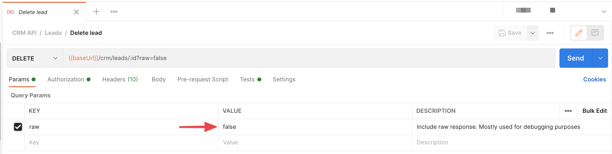
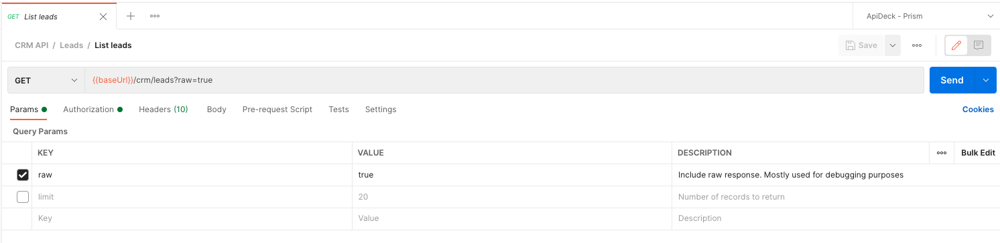
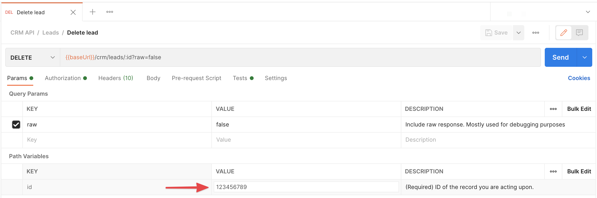
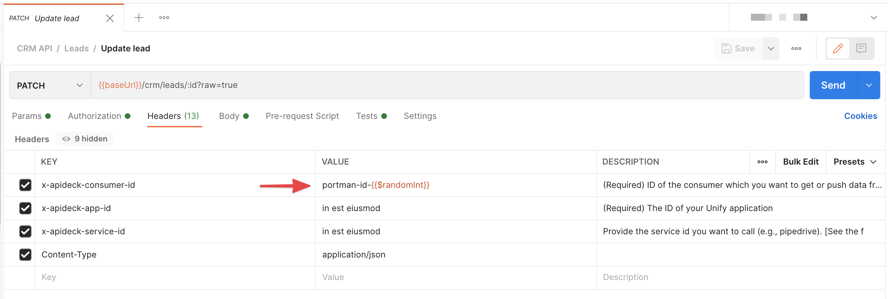

# OpenAPI Postman test suite generation - overwrites

In the "[examples/testsuite-contract-tests](https://github.com/apideck-libraries/portman/tree/main/examples/testsuite-contract-tests)" example, we explained the default generated Postman contract tests.

This example focuses on the manipulation of the Postman collection to make it possible to automate, by manipulating:

- Request bodies
- Request headers
- Request query params
- Request path variables

_use-cases_:

- Generate Postman flows that require unique values
- Reference a created entity to be used in Read/Update/Delete flows by setting the ID reference as query parameter
- Overwrite an example value with an actual value that exists in the API

## CLI usage

```ssh
portman --cliOptionsFile ./examples/testsuite-overwrites/portman-cli-options.json
```

Configured by using the portman-cli config.

This is an example where we take the OpenAPI defined in `crm.yml`, with only 1 entity (leads) to keep the example simple and overwrite specific values in the generated Postman collection.

## Portman settings

The portman settings (in JSON format) consists out of multiple parts, in this example we focus on the **overwrites** section and settings.

file: examples/testsuite-overwrites/portman-config.crm.json

## Portman - "overwrites" properties

Version 1.0

To facilitate automation, you might want to modify property values with "randomized" or specific values. The overwrites are mapped based on the OpenAPI operationId or OpenAPI Operation reference.

### Target options:

- **openApiOperationId (String)** : Reference to the OpenAPI operationId for which the Postman request body will be extended. (example: `leadsAll`)
- **openApiOperation (String)** : Reference to combination of the OpenAPI method & path, for which the Postman request body will be extended (example: `GET::/crm/leads`)

These target options are both supported for defining a target. In case both are set for the same target, only the `openApiOperationId` will be used for overwrites. See below for more options on targeting.

### Overwrite options:

- **overwriteRequestQueryParams (Array)** :
  
  Array of key/value pairs to overwrite in the Postman Request Query params.

  - **key (String)** : The key that will be targeted in the request Query Param to overwrite/extend.
  - **value (String)** : The value that will be used to overwrite/extend the value in the request Query Param OR use the [Postman Dynamic variables](https://learning.Postman.com/docs/writing-scripts/script-references/variables-list/) to use dynamic values like `{{$guid}}` or `{{$randomInt}}`.
  - **overwrite (Boolean true/false | Default: true)** : Overwrites the request query param value OR attach the value to the original request query param value.
  - **disable (Boolean true/false | Default: false)** : Disables the request query param in Postman.
  - **remove (Boolean true/false | Default: false)** : Removes the targeted request query param from Postman.
  - **insert (Boolean true/false | Default: true)** : Insert additional the request query param in Postman that are not present in OpenAPI.

- **overwriteRequestPathVariables (Array)** : 
  
  Array of key/value pairs to overwrite in the Postman Request Path Variables.

  - **key (String)** : The key that will be targeted in the request Path variables to overwrite/extend.
  - **value (String)** : The value that will be used to overwrite/extend the value in the request path variable OR use the [Postman Dynamic variables](https://learning.Postman.com/docs/writing-scripts/script-references/variables-list/) to use dynamic values like `{{$guid}}` or `{{$randomInt}}`.
  - **overwrite (Boolean true/false | Default: true)** : Overwrites the request path variable value OR attach the value to the original request Path variable value.
  - **remove (Boolean true/false | Default: false)** : Removes the request path variable

- **overwriteRequestHeaders (Array)** :

  Array of key/value pairs to overwrite in the Postman Request Headers.

  - **key (String)** : The key that will be targeted in the request Headers to overwrite/extend.
  - **value (String)** : The value that will be used to overwrite/extend the value in the request headers OR use the [Postman Dynamic variables](https://learning.Postman.com/docs/writing-scripts/script-references/variables-list/) to use dynamic values like `{{$guid}}` or `{{$randomInt}}`.
  - **overwrite (Boolean true/false | Default: true)** : Overwrites the request header value OR attach the value to the original request header value.
  - **remove (Boolean true/false | Default: false)** : Removes the targeted request headers from Postman.
  - **insert (Boolean true/false | Default: true)** : Insert additional the request headers in Postman that are not present in OpenAPI.

- **overwriteRequestBody (Array)** :

  Array of key/value pairs to overwrite in the Postman Request Body.

  - **key (String)** : The key that will be targeted in the request body to overwrite/extend.
  - **value (String)** : The value that will be used to overwrite/extend the key in the request body OR use the [Postman Dynamic variables](https://learning.Postman.com/docs/writing-scripts/script-references/variables-list/) to use dynamic values like `{{$guid}}` or `{{$randomInt}}`.
  - **overwrite (Boolean true/false | Default: true)** : Overwrites the request body value OR attach the value to the original request body value.
  - **remove (Boolean true/false | Default: false)** : Removes the request body property, including the value.


## Example explained

In this example, we are zooming in on only the overwrites usage. For the basics on the testsuite configuration and usage in Portman, have a look at ["examples/testsuite-contract-tests"]("https://github.com/apideck-libraries/portman/tree/main/examples/testsuite-contract-tests")

file: examples/testsuite-overwrites/portman-config.crm.json >>

```json
  "overwrites": [
    {
      "openApiOperationId": "leadsAdd",
      "overwriteRequestBody": [
        {
          "key": "name",
          "value": "--{{$randomInt}}",
          "overwrite": false
        },
        {
          "key": "company_name",
          "value": "{{$randomCompanyName}} {{$randomColor}}",
          "overwrite": true
        },
        {
          "key": "monetary_amount",
          "value": "{{$randomInt}}",
          "overwrite": true
        },
        {
          "key": "websites[0]",
          "remove": true
        },
        {
          "key": "social_links[1].url",
          "remove": true
        }
      ]
    },
    {
      "openApiOperation": "DELETE::/crm/leads/{id}",
      "overwriteRequestQueryParams": [
        {
          "key": "raw",
          "value": "false",
          "overwrite": true
        }
      ],
      "overwriteRequestPathVariables": [
        {
          "key": "id",
          "value": "123456789",
          "overwrite": true
        }
      ]
    },
    {
      "openApiOperationId": "leadsUpdate",
      "overwriteRequestHeaders": [
        {
          "key": "x-apideck-consumer-id",
          "value": "portman-id-{{$randomInt}}",
          "overwrite": true
        },
        {
          "key": "x-apideck-consumer-id-additional",
          "value": "portman-id-{{$randomInt}}-additional",
          "insert": true
        }
      ]
    },
    {
      "openApiOperationId": "leadsAll",
      "overwriteRequestQueryParams": [
        {
          "key": "limit",
          "disable": true
        },
        {
          "key": "cursor",
          "remove": true
        }
      ]
    }
  ]
```

### overwriteRequestBody

```json
{
  "openApiOperationId": "leadsAdd",
  "overwriteRequestBody": [
    {
      "key": "name",
      "value": "--{{$randomInt}}",
      "overwrite": false
    },
    {
      "key": "company_name",
      "value": "{{$randomCompanyName}} {{$randomColor}}",
      "overwrite": true
    },{
      "key": "monetary_amount",
      "value": "{{$randomInt}}",
      "overwrite": true
    },
    {
      "key": "websites[0]",
      "remove": true
    },
    {
      "key": "social_links[1].url",
      "remove": true
    }
  ]
}
```

This will target the OpenAPI `"openApiOperationId": "leadsAdd"` and will overwrite the request body.

1. the `name` property will be **extended** (because overwrite:false) with `--{{$randomInt}}`
2. the `company_name`property will be **overwritten** (because overwrite:true) with `{{randomCompanyName}} {{randomColor}}`
3. the `monetary_amount` property will be **overwritten** (because overwrite:true) with `{{$randomInt}}` which will be a number (not a string).
4. the `"websites[0]` item will be **removed** (because remove:true), which will results in the 1st item in the `websites` array to be removed. The index of the array will be reset.
5. the `social_links[1].url` property will be **removed** (because remove:true) with the nested `url` property from the 2nd item of the `social_links` array removed.

After the conversion, in the "leadsAdd" request (POST::/crm/leads) in the Postman app, you can find the following result in the request body.

file: examples/testsuite-overwrites/crm.postman.json >>

Postman request "Leads" >> "Create lead" Request body:

```json
{
  "name": "Elon Musk--{{$randomInt}}",
  "company_name": "{{$randomCompanyName}} {{$randomColor}}",
  "owner_id": "54321",
  "company_id": "2",
  "contact_id": "2",
  "first_name": "Elon",
  "last_name": "Musk",
  "description": "A thinker",
  "monetary_amount": {{$randomInt}},
  "websites": [
    {
      "url": "http://example.com",
      "id": "12345",
      "type": "primary"
    }
  ],
  "social_links": [
    {
      "url": "https://www.twitter.com/apideck-io",
      "id": "12345",
      "type": "twitter"
    },
    {
      "id": "12345",
      "type": "twitter"
    }
  ]
}
```

Each time the request is executed in Postman, the `{{$random}}` variables will be generated with random values like defined on the [Postman Dynamic variables](https://learning.postman.com/docs/writing-scripts/script-references/variables-list/) page.

### overwriteRequestQueryParams

```json
{
  "openApiOperation": "DELETE::/crm/leads/{id}",
  "overwriteRequestQueryParams": [
    {
      "key": "raw",
      "value": "false",
      "overwrite": true
    }
  ]
}
```

This will target the OpenAPI `"openApiOperation": "DELETE::/crm/leads/{id}"` and will overwrite the request query params.
1. The `raw` property will be **overwritten** (because overwrite:true) with `"false"`

After the conversion, in the "leadsDelete" request (DELETE::/crm/leads/{id}) in the Postman app, you can find the following result in the request query params.

file: examples/testsuite-overwrites/crm.postman.json >>

Postman request "Leads" >> "Delete lead" Request query params:



The example below will showcase the "disable" setting.

```json
{
  "openApiOperationId": "leadsAll",
  "overwriteRequestQueryParams": [
    {
      "key": "limit",
      "disable": true
    },{
      "key": "cursor",
      "remove": true
    },{
      "key": "count",
      "value": "yes",
      "disable": true,
      "description": "Get total result count"
    }
  ]
}
```

This will target the OpenAPI `"openApiOperationId": "leadsAll"` . 

1. The request query params will set the `limit` property as **disabled** (because disable:true) in Postman.
1. **Remove** the request `cursor` query param (because remove:true) from Postman.
1. **Insert** the new request `count` query param into the Postman collection, with a value & description.

file: examples/testsuite-overwrites/crm.postman.json >>

Postman request "Leads" >> "Get leads" Request query params:



## overwriteRequestPathVariables

```json
{
  "openApiOperation": "DELETE::/crm/leads/{id}",
  "overwriteRequestPathVariables": [
    {
      "key": "id",
      "value": "123456789",
      "overwrite": true
    }
  ]
}
```

This will target the OpenAPI `"openApiOperation": "DELETE::/crm/leads/{id}"` and will overwrite the request query params.

1. the `id`property will be **overwritten** (because overwrite:true) with `123456789`

After the conversion, in the "leadsDelete" request (DELETE::/crm/leads/{id}) in the Postman app, you can find the following result in the request Path variables.

file: examples/testsuite-overwrites/crm.postman.json >>

Postman request "Leads" >> "Delete lead" Request query params:



### overwriteRequestQueryParams

```json
{
  "openApiOperationId": "leadsUpdate",
  "overwriteRequestHeaders": [
    {
      "key": "x-apideck-consumer-id",
      "value": "portman-id-{{$randomInt}}",
      "overwrite": true
    },
    {
      "key": "x-apideck-consumer-id-additional",
      "value": "portman-id-{{$randomInt}}-additional"
    }
  ]
}
```

This will target the OpenAPI `"openApiOperationId": "leadsUpdate"` and will overwrite the request query params.

1. the `x-apideck-consumer-id` header property will be **overwritten** (because overwrite:true) with `portman-id-{{$randomInt}}`
2. the `x-apideck-consumer-id-additional` header does not exist, so this new header will be **inserted** with `portman-id-{{$randomInt}}-additional`

After the conversion, in the "leadsUpdate" request (PATCH::/crm/leads/{id}) in the Postman app, you can find the following result in the headers tab.

file: examples/testsuite-overwrites/crm.postman.json >>

Postman request "Leads" >> "Update lead" Request headers:


