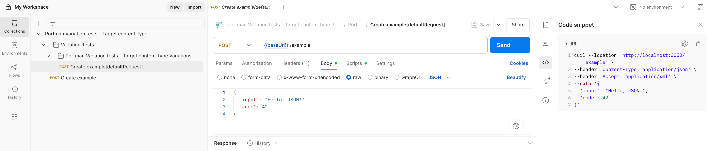
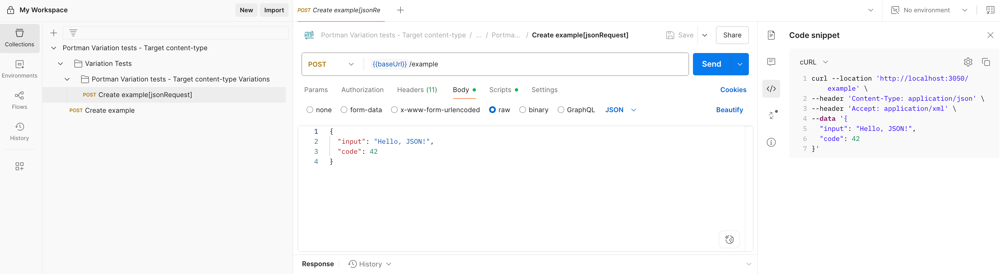
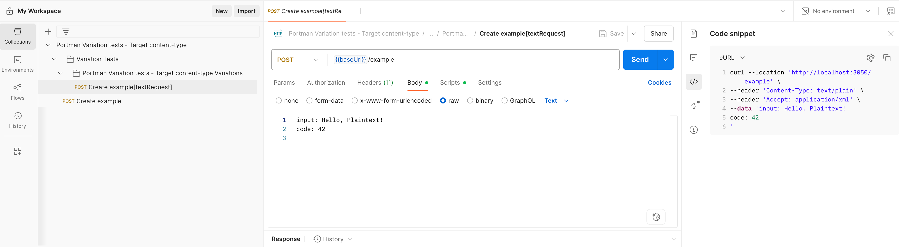
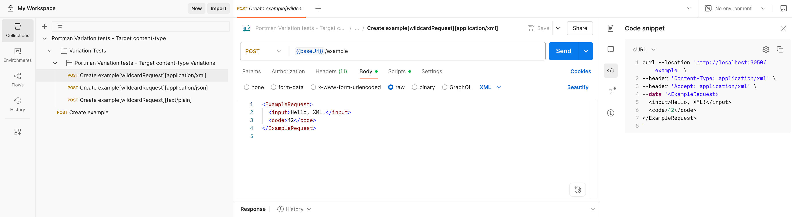
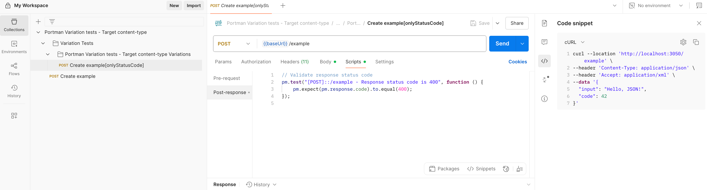
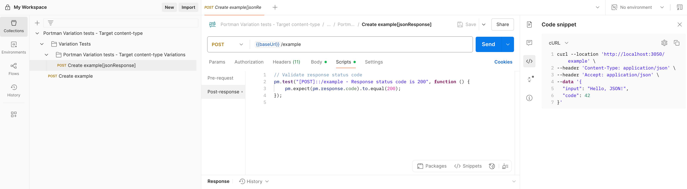

# OpenAPI Postman variation test suite - Content-Type scenarios

This example demonstrates how `openApiRequest` and `openApiResponse` can be used
when an API endpoint supports multiple content types. The OpenAPI document
`content-types.openapi.yml` exposes a single `POST /example` operation that
accepts XML, JSON and plain text requests and responds with the same set of
content types for both `200` and `400` responses.

_use-case_: convert the OpenAPI spec to a Postman collection and generate several
variations that explicitly target request and response content-types.

## CLI usage

```ssh
portman --cliOptionsFile ./examples/testsuite-variation-content-types/portman-cli-options.json
```

Configured by using the portman-cli config.

## Portman settings

The `portman-config.ct.json` contains a set of variations demonstrating the
different options for `openApiRequest` and `openApiResponse`.

file: examples/testsuite-variation-content-types/portman-config.ct.json >>

```json
{
  "version": 1.0,
  "tests": {
    "variationTests": [
      {
        "openApiOperationId": "createExample",
        "variations": [
          {
            "name": "jsonRequestJsonResponse",
            "openApiRequest": "application/json",
            "openApiResponse": "200::application/json",
            "tests": {
              "contractTests": [
                {
                  "statusCode": { "enabled": true },
                  "jsonBody": { "enabled": true },
                  "schemaValidation": { "enabled": true }
                }
              ]
            }
          },
          {
            "name": "xmlRequestXmlResponse",
            "openApiRequest": "application/xml",
            "openApiResponse": "200::application/xml",
            "tests": {
              "contractTests": [
                {
                  "statusCode": { "enabled": true },
                  "contentType": { "enabled": true }
                }
              ]
            }
          },
          {
            "name": "textRequestTextResponse",
            "openApiRequest": "text/plain",
            "openApiResponse": "200::text/plain",
            "tests": {
              "contractTests": [
                { "statusCode": { "enabled": true } }
              ]
            }
          },
          {
            "name": "wildcardContentTypes",
            "tests": {
              "contractTests": [
                { "statusCode": { "enabled": true } }
              ]
            }
          },
          {
            "name": "errorResponse",
            "openApiRequest": "application/json",
            "openApiResponse": "400",
            "overwrites": [
              {
                "overwriteRequestBody": [
                  { "key": "input", "value": "", "overwrite": true }
                ]
              }
            ],
            "tests": {
              "contractTests": [
                {
                  "statusCode": { "enabled": true },
                  "jsonBody": { "enabled": true },
                  "schemaValidation": { "enabled": true }
                }
              ]
            }
          }
        ]
      }
    ]
  },
  "globals": {
    "stripResponseExamples": true
  }
}
```

### Variations explained

- **jsonRequestJsonResponse** - Specific `openApiRequest` and `openApiResponse`
  for the JSON content type.
- **xmlRequestXmlResponse** - Variation targeting XML request and response.
- **textRequestTextResponse** - Variation for `text/plain` request and response.
- **wildcardContentTypes** - Uses wildcards for both request and response
  content types.
- **errorResponse** - Expects a `400` response by overwriting the request body to
  trigger an error.

### `openApiRequest` examples

The `openApiRequest` property controls which request body content type Portman uses for a variation. In these examples it is defined next to `openApiOperationId` inside each `variationTests` object.

**Without `openApiRequest`**

```json
{
  "tests": {
    "variationTests": [
      {
        "openApiOperationId": "createExample",
        "variations": [
          {
            "name": "defaultRequest",
            "tests": {
              "contractTests": [
                { "statusCode": { "enabled": true } }
              ]
            }
          }
        ]
      }
    ]
  }
}
```



**Explicit request types**

```json
{
  "tests": {
    "variationTests": [
      {
        "openApiOperationId": "createExample",
        "openApiRequest": "application/json",
        "variations": [
          {
            "name": "jsonRequest",
            "tests": {
              "contractTests": [
                { "statusCode": { "enabled": true } }
              ]
            }
          }
        ]
      }
    ]
  }
}
```



```json
{
  "tests": {
    "variationTests": [
      {
        "openApiOperationId": "createExample",
        "openApiRequest": "application/xml",
        "variations": [
          {
            "name": "xmlRequest",
            "tests": {
              "contractTests": [
                { "statusCode": { "enabled": true } }
              ]
            }
          }
        ]
      }
    ]
  }
}
```


```json
{
  "tests": {
    "variationTests": [
      {
        "openApiOperationId": "createExample",
        "openApiRequest": "text/plain",
        "variations": [
          {
            "name": "textRequest",
            "tests": {
              "contractTests": [
                { "statusCode": { "enabled": true } }
              ]
            }
          }
        ]
      }
    ]
  }
}
```



**Wildcard request type**

```json
{
  "tests": {
    "variationTests": [
      {
        "openApiOperationId": "createExample",
        "openApiRequest": "*/*",
        "variations": [
          {
            "name": "wildcardRequest",
            "tests": {
              "contractTests": [
                { "statusCode": { "enabled": true } }
              ]
            }
          }
        ]
      }
    ]
  }
}
```



Supported values include `application/json`, `application/xml` and `text/plain`.

### `openApiResponse` examples

The `openApiResponse` property selects the expected response code and content type. In these examples it is defined alongside `openApiOperationId` inside the `variationTests` items.

**Without `openApiResponse`**

```json
{
  "tests": {
    "variationTests": [
      {
        "openApiOperationId": "createExample",
        "variations": [
          {
            "name": "defaultResponse",
            "tests": {
              "contractTests": [
                { "statusCode": { "enabled": true } }
              ]
            }
          }
        ]
      }
    ]
  }
}
```


**Status code only**

```json
{
  "tests": {
    "variationTests": [
      {
        "openApiOperationId": "createExample",
        "openApiResponse": "400",
        "variations": [
          {
            "name": "onlyStatusCode",
            "tests": {
              "contractTests": [
                { "statusCode": { "enabled": true } }
              ]
            }
          }
        ]
      }
    ]
  }
}
```



**Status code and content type**

```json
{
  "tests": {
    "variationTests": [
      {
        "openApiOperationId": "createExample",
        "openApiResponse": "200::application/json",
        "variations": [
          {
            "name": "jsonResponse",
            "tests": {
              "contractTests": [
                { "statusCode": { "enabled": true } }
              ]
            }
          }
        ]
      }
    ]
  }
}
```


**Wildcard content type**

```json
{
  "tests": {
    "variationTests": [
      {
        "openApiOperationId": "createExample",
        "openApiResponse": "200::*",
        "variations": [
          {
            "name": "wildcardResponse",
            "tests": {
              "contractTests": [
                { "statusCode": { "enabled": true } }
              ]
            }
          }
        ]
      }
    ]
  }
}
```


All combinations of `openApiResponse` for this example include:

- `200::application/json`
- `200::application/xml`
- `200::text/plain`
- `400::application/json`
- `400::application/xml`
- `400::text/plain`

### Combined `openApiRequest` and `openApiResponse` example

**Wildcard Request and Response content type**

```json
{
  "tests": {
    "variationTests": [
      {
        "openApiOperationId": "createExample",
        "openApiRequest": "*",
        "openApiResponse": "*::*",
        "variations": [
          {
            "name": "wildcardRequestResponse",
            "tests": {
              "contractTests": [
                { "statusCode": { "enabled": true } }
              ]
            }
          }
        ]
      }
    ]
  }
}
```


### Running the collection

Run the generated Postman collection to see each variation in action. You can use the Postman app or run it headless with Newman:

```bash
newman run ./content-types.postman.json
```

Each variation issues a request using the configured `openApiRequest` content type and checks the response as dictated by `openApiResponse`. Feel free to duplicate a variation and adjust these settings to cover any other content types your API supports.

### Tips for combining wildcards

When `openApiRequest` or `openApiResponse` uses wildcards (`*`), Portman picks the first matching example from your specification. This keeps the configuration compact when you want a single test to validate multiple acceptable formats. Mix and match wildcards with explicit values to cover very specific cases alongside broader ones.
