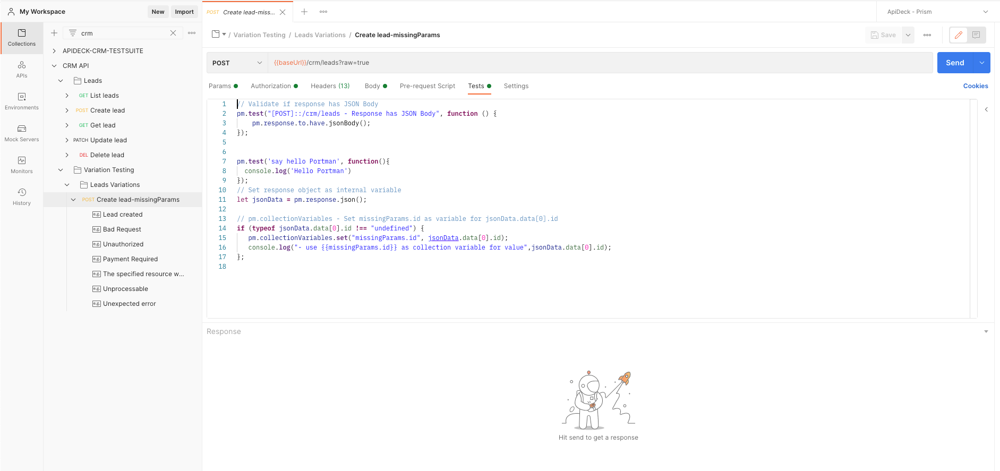

# OpenAPI Postman variation test suite generation

This example contains the configuration for the Portman variation test generation, which will convert the OpenAPI document to a Postman collection, while adding Postman tests and additional variations. The generated tests are focussed on the variations of API contracts.

The [contract tests](https://github.com/apideck-libraries/portman/tree/main/examples/testsuite-contract-tests) cover the "happy" test path for success.
The happy path is used to verify the API response, with the assumption that all required request input is properly defined. For this we use the "example" values as defined in the OpenAPI document.

For variation testing, we want to test for 2 types of results:

- **happy path variations**: Typically you test all possible query parameters/headers/..., that should respond with a 2xx
- **unhappy path variations** . We verify if the API response is matching with the expected invalid or error response. By providing invalid input in the request body/headers/query params, this would result in expected 4xx/5xx responses.

_use-cases_:

- Test all possible query params that should return a 2xx
- Test all possible headers that should return a 2xx
- Test API validation responses, with invalid response body properties
- Test API error responses, with invalid API request
- Test API invalid authentication responses

## CLI usage

```ssh
portman --cliOptionsFile ./examples/testsuite-variation-tests/portman-cli-options.json
```

Configured by using the portman-cli config.

This is an example where we take the OpenAPI defined in `crm.yml`, with only 1 entity (leads) to keep the example simple and convert to Postman with all the default contract tests generated out-of-the-box and include a variation.

## Portman settings

The portman settings (in JSON format) consists out of multiple parts:

- **version** : which refers to the Portman configuration version

- **tests** : which refers to the definitions for the generated contract & variance tests.

  - **contractTests** : refers to the options to enabled autogenerated contract tests.

  - **contentTests**: refers to the additional Postman tests that check the content.

  - **extendTests**: refers to the custom additions of manual created Postman tests.

  - **variationTests** : refers to the options to define variation tests.

In this example we focus on the **variationTests** section and settings.

file: examples/testsuite-variation-tests/portman-config.crm.json

```json
{
  "version": 1.0,
  "tests": {
    "variationTests": [
      {
        "openApiOperationId": "leadsAdd",
        "openApiResponse": "400",
        "variations": [
          {
            "name": "missingParams",
            "overwrites": [
              {
                "overwriteRequestBody": [
                  {
                    "key": "first_name",
                    "value": "",
                    "overwrite": true
                  }
                ]
              }
            ],
            "tests": {
              "contractTests": [
                {
                  "statusCode": {
                    "enabled": true,
                    "code": 400
                  }
                },
                {
                  "jsonBody": {
                    "enabled": true
                  }
                },
                {
                  "schemaValidation": {
                    "enabled": true
                  }
                }
              ],
              "contentTests": [
                {
                  "responseBodyTests": [
                    {
                      "key": "typeName",
                      "value": "RequestBodyValidationError"
                    }
                  ]
                }
              ],
              "extendTests": [
                {
                  "append": false,
                  "tests": [
                    "// Validate status Implemented \nif(pm.response.status === 'Not Implemented'){ return };\n"
                  ]
                }
              ]
            },
            "assignVariables": [
              {
                "collectionVariables": [
                  {
                    "responseBodyProp": "data[0].id",
                    "name": "missingParams.id"
                  }
                ]
              }
            ]
          }
        ]
      }
    ]
  }
}
```

## Portman - "variationTest" properties

Version 1.0

Variation tests can be injected by using the following properties:

- **openApiOperationId (String)** : References to the OpenAPI operationId for which a variation will be created. (example: `leadsAll`)

- **openApiOperation (String)** : References to a combination of the OpenAPI method & path for which a variation will be created. (example: `GET::/crm/leads`)

- **excludeForOperations (Array | optional)** : References to OpenAPI operations that will be skipped for targeting, example: `["leadsAdd", "GET::/crm/leads/{id}"]`

- **openApiResponse (String | optional)** : References to the OpenAPI response object code/name for which a variation will be created. (example: `"404"`). If not defined, the 1st response object from OpenAPI will be taken as expected response. If the configured `openApiResponse` code is not defined in the OpenAPI document, Portman will not generate a variation for the targeted operations.

- **variations (Array )** : References to list of a variations that will be injected

  - **name** : allows you to define the name for the variation, which will be referenced in the Postman collection.
  - **openApiResponse (OPTIONAL)** : allows you to define the expected openAPI response information, on which the contract tests will base their automatic generated test injection, like schema validation, jsonBody, contentType, headersPresent. If not defined, the contract tests for the specific variation will fallback on the 2xx/302 defined response in the OpenAPI specification.

  - **tests** : refers to the definitions for the specific tests for the variation.

    - **contractTests** : refers to the options to enabled contract tests for the variation.
    - **contentTests** : refers to the additional Postman tests that check the content for the variation.
    - **extendTests** : refers to the custom additions of manual created Postman tests to be included in the variation.

  - **assignVariables** : This refers to setting Postman collection variables that are assigned based on variation.

  - **overwrites** : which refers to the custom additions/modifications of the OpenAPI/Postman request data, specifically for the variation.

## Example explained

file: examples/testsuite-variation-tests/portman-config.crm.json >>

```json
  "variationTests": [
      {
        "openApiOperationId": "leadsAdd",
        "openApiResponse": "400",
        "variations": [
          {
            "name": "missingParams",
            "overwrites": [
              {
                "verwriteRequestBody": [
                  {
                    "key": "first_name",
                    "value": "",
                    "overwrite": true
                  }
                ]
              }
            ],
            "tests": {
              "contractTests": [
                {
                  "statusCode": {
                    "enabled": true,
                  }
                },
                {
                  "jsonBody": {
                  "enabled": true
                  }
                },
                {
                  "schemaValidation": {
                  "enabled": true
                  }
                }
              ],
              "contentTests": [
                {
                  "responseBodyTests": [
                    {
                      "key": "resource",
                      "value": "leads"
                    }
                  ]
                }
              ],
              "extendTests": [
                {
                  "tests": [
                    "\npm.test('say hello Portman', function(){ \n  console.log('Hello Portman')\n});"
                  ]
                }
              ]
            },
            "assignVariables": [
              {
                "collectionVariables": [
                  {
                    "responseBodyProp": "data[0].id",
                    "name": "missingParams.id"
                  }
                ]
              }
            ]
          }
        ]
      }
    ]

```

This will result in a Postman collection with:

- **Normal "Leads" folder**: which contains all the "happy path" tests

- **"Variation testing" folder**: which contains all the variation tests that have be specified



## Target

```json
"openApiOperationId": "leadsAdd",
"openApiResponse": "400",
```

We want to generate a variation specifically with `leadsApp` OpenAPI operation as the target and verify if the response matches with the expected "400" reponse object, as defined in the OpenAPI document.

## overwrites

```json
"overwrites": [
              {
                "overwriteRequestBody": [
                  {
                    "key": "first_name",
                    "value": "",
                    "overwrite": true
                  }
                ]
              }
            ]
```

The overwrites contains the list of all the overwrites you want to do on the targeted `leadsApp` request.

In our example we want to overwrite the `first_name` property of the request body.

Any of the available ["overwrites" options](https://github.com/apideck-libraries/portman/tree/main#portman---overwrites-properties) can be used for the variance.

## Tests

A variance support all test types:

- **contractTests** : refers to the options to enabled autogenerated contract tests for the variation.

- **contentTests** : refers to the additional Postman tests that check the content for the variation.

- **extendTests** : refers to the custom additions of manual created Postman tests to be included in the variation.

### contractTests

```json
"contractTests": [
                {
                  "statusCode": {
                    "enabled": true,
                  },
                  "jsonBody": {
                    "enabled": true
                  },
                  "schemaValidation": {
                    "enabled": true
                  }
                }
              ],
```

The contract tests will be injected for this specific `leadsApp`variation.

In our example we added a statusCode check to verify that the HTTP response code is a 400, check if the response body is in JSON format and do a JSON schema validation based on the OpenAPI 400 response.

Any of the available ["contract test" options](https://github.com/apideck-libraries/portman/tree/main#portman---contracttests-options) can be used for the variance.

### contentTests

```json
"contentTests": [
                {
                  "responseBodyTests": [
                    {
                      "key": "resource",
                      "value": "leads"
                    }
                  ]
                }
              ],
```

The content tests will be added for the targeted `leadsApp`variation.

In our example, we added the content test to verify that the response body contains the `resource` property with the value `leads`

Any of the available ["content test" options](https://github.com/apideck-libraries/portman/tree/main#portman---contenttests-properties) can be used for the variance.

### extendTests

```json
"extendTests": [
                {
                  "tests": [
                    "\npm.test('say hello Portman', function(){ \n  console.log('Hello Portman')\n});"
                  ]
                }
              ]
```

The "extendTests" section allows you to define additional tests that can used for the targeted `leadsApp`variation.

In our example, we added a "say hello portman" Postman test, that will be added after all the other tests.

Any of the available ["extend test options"](https://github.com/apideck-libraries/portman/tree/main#portman---extendtests-properties) can be used for the variance.

### assignVariables

```json
"assignVariables": [
              {
                "collectionVariables": [
                  {
                    "responseBodyProp": "data[0].id",
                    "name": "missingParams.id"
                  }
                ]
              }
            ]
```

When using variations, it can also be useful to assign relevant variables based on the response/request to be used afterwards in the Postman collection.

In our example, we added a Postman collection variable with the variable name `missingParams.id` for the response body property `data[0].id`.

Any of the available ["assign variables options"](https://github.com/apideck-libraries/portman/tree/main#portman---assignvariables-properties) can be used for the variance.
